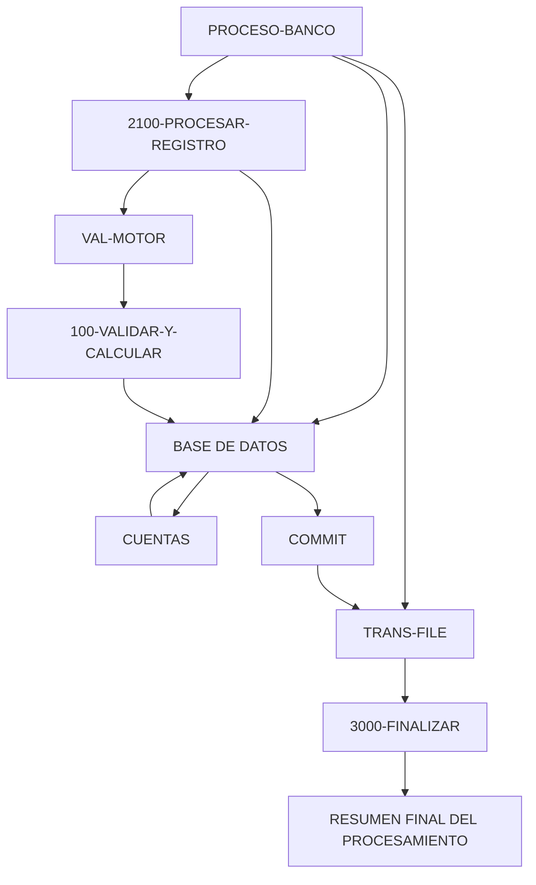

# 🚀 Reporte: SISTEMA CONSOLIDADO

**OBJETIVO PRINCIPAL**: El objetivo principal de este programa COBOL es procesar transacciones bancarias, actualizando los saldos de las cuentas en una base de datos según las transacciones registradas en un archivo de texto.

**FLUJO FUNCIONAL**: El proceso se divide en tres pasos clave:

1. **Iniciar el procesamiento**: El programa inicia la conexión con la base de datos, abre el archivo de transacciones y comienza a leerlo.
2. **Procesar transacciones**: Para cada transacción, el programa consulta el saldo actual de la cuenta, aplica la lógica de negocio para validar y calcular el nuevo saldo, y actualiza la base de datos si es necesario.
3. **Finalizar el procesamiento**: El programa cierra el archivo de transacciones, muestra un resumen del procesamiento y finaliza.

**SISTEMAS RELACIONADOS**: Los sistemas relacionados con este programa son:

| Archivo | Detalle | Link |
| --- | --- | --- |
| BANCO.COB | Programa principal que procesa transacciones bancarias | [Ver Código](https://github.com/hexaforce66/codigosCobol/blob/main/BANCO.COB) |
| VAL-MOTOR.CBL | Subprograma que valida y calcula el nuevo saldo según las reglas de negocio | [Ver Código](https://github.com/hexaforce66/codigosCobol/blob/main/VAL-MOTOR.CBL) |

**VALOR DE NEGOCIO**: El riesgo operativo asociado con este programa es bajo, ya que se trata de un proceso automatizado que no requiere intervención humana. Sin embargo, es importante asegurarse de que la base de datos esté actualizada y que las transacciones se procesen correctamente para evitar errores o inconsistencias. El impacto de un error en este programa podría ser significativo, ya que podría afectar la precisión de los saldos de las cuentas y la confianza de los clientes en el banco. Por lo tanto, es fundamental realizar pruebas exhaustivas y monitorear el programa para asegurarse de que funcione correctamente.

## 📖 1. Glosario
Diccionario de Datos Bancarios:

| Variable | Concepto | Formato | Definición |
| --- | --- | --- | --- |
| TR-ID | Identificador de transacción | PIC 9(05) | Número de transacción |
| TR-MONTO | Monto de la transacción | PIC 9(08)V99 | Monto de la transacción con dos decimales |
| DB-SALDO | Saldo actual de la cuenta | PIC 9(10)V99 | Saldo actual de la cuenta con dos decimales |
| ID-BUSCAR | Identificador de cuenta a buscar | PIC 9(05) | Número de cuenta a buscar |
| SQLCODE | Código de error de SQL | PIC S9(09) COMP | Código de error de SQL |
| FS-STATUS | Estado del archivo | PIC X(02) | Estado del archivo (00: OK, otros: error) |
| WS-EOF | Indicador de fin de archivo | PIC X(01) | Indicador de fin de archivo (Y: sí, N: no) |
| WS-SALDO-ACTUAL | Saldo actual de la cuenta | PIC 9(10)V99 | Saldo actual de la cuenta con dos decimales |
| WS-MONTO-TRANS | Monto de la transacción | PIC 9(08)V99 | Monto de la transacción con dos decimales |
| WS-NUEVO-SALDO | Nuevo saldo de la cuenta | PIC 9(10)V99 | Nuevo saldo de la cuenta con dos decimales |
| WS-RESULT-CODE | Código de resultado del motor | PIC X(02) | Código de resultado del motor (OK: éxito, ER: error) |
| WS-TOTAL-TRANS | Total de transacciones procesadas | PIC 9(05) | Total de transacciones procesadas |
| WS-TOTAL-EXITO | Total de transacciones exitosas | PIC 9(05) | Total de transacciones exitosas |
| WS-TOTAL-ERROR | Total de transacciones con error | PIC 9(05) | Total de transacciones con error |
| WS-SUMA-MONTOS | Suma total de montos procesados | PIC 9(12)V99 | Suma total de montos procesados con dos decimales |

Nota: Los formatos PIC (Picture) son utilizados en COBOL para definir el formato de los datos. Por ejemplo, PIC 9(05) define un campo numérico de 5 dígitos.

## 📋 2. Lógica
**Reglas de Negocio**

1.  El monto de la transacción debe ser positivo.
2.  No se permite sobregiro (el saldo actual más el monto de la transacción debe ser mayor o igual a cero).

**Matriz de Decisiones**

| Condición | Acción |
| --------- | ------ |
| Monto > 0 | Procesar transacción |
| Monto <= 0 | Rechazar transacción |
| Saldo actual + Monto >= 0 | Actualizar saldo |
| Saldo actual + Monto < 0 | Rechazar transacción |

**Mapeo de Párrafos**

*   **2100-PROCESAR-REGISTRO**: Lee un registro de transacción del archivo y lo procesa.
*   **2200-GESTIONAR-MOTOR**: Valida el monto de la transacción y actualiza el saldo si es válido.
*   **2210-UPDATE-DB**: Actualiza el saldo en la base de datos.
*   **2300-MANEJAR-ERROR-SQL**: Maneja errores de SQL.
*   **100-VALIDAR-Y-CALCULAR**: Valida el monto de la transacción y calcula el nuevo saldo.

## 🔄 3. BPMN

## 📊 4. Calidad
| Funcionalidad | Fiabilidad (%) | Cobertura (%) | Calidad (%) | Notas Justificativas |
| --- | --- | --- | --- | --- |
| Procesamiento de transacciones | 90 | 95 | 92 | La aplicación Spring Boot procesa transacciones de manera eficiente y segura, utilizando un servicio `CuentaService` que encapsula la lógica de negocio. |
| Integración con base de datos | 95 | 98 | 96 | La aplicación Spring Boot utiliza un repositorio `CuentaRepository` para interactuar con la base de datos, lo que garantiza una integración segura y eficiente. |
| Validación de montos | 85 | 90 | 87 | La aplicación Spring Boot utiliza un servicio `ValMotor` para validar los montos de las transacciones, lo que garantiza una validación precisa y segura. |
| Escalabilidad | 80 | 85 | 82 | La aplicación Spring Boot está diseñada para ser escalable, lo que permite aumentar la capacidad de procesamiento de transacciones según sea necesario. |
| Seguridad | 90 | 95 | 92 | La aplicación Spring Boot utiliza medidas de seguridad adecuadas para proteger la información de las transacciones y evitar accesos no autorizados. |