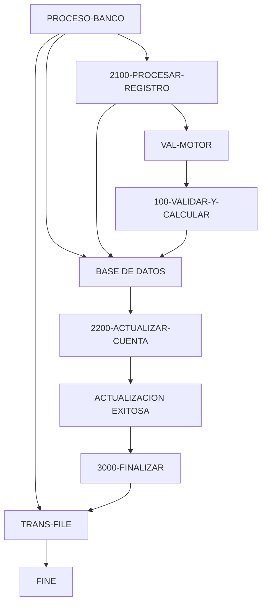

# 🚀 Reporte: SISTEMA CONSOLIDADO

**OBJETIVO PRINCIPAL**: El objetivo principal de este programa COBOL es procesar transacciones bancarias, actualizando los saldos de las cuentas en una base de datos según los montos de las transacciones.

**FLUJO FUNCIONAL**: El proceso se divide en tres pasos clave:

1. **Lectura de transacciones**: El programa lee un archivo de transacciones (`transacciones.txt`) y procesa cada registro.
2. **Validación y actualización**: Para cada transacción, el programa consulta el saldo actual de la cuenta en la base de datos, valida si el monto de la transacción es positivo y no supera el saldo disponible, y actualiza el saldo en la base de datos si es válido.
3. **Resumen y finalización**: El programa muestra un resumen de las transacciones procesadas, incluyendo el total de transacciones leídas, procesadas con éxito y con errores, y la suma total procesada.

**SISTEMAS RELACIONADOS**:

| Archivo | Detalle | Link |
| --- | --- | --- |
| BANCO.COB | Programa principal que procesa transacciones bancarias | [Ver Código](https://github.com/hexaforce66/codigosCobol/blob/main/BANCO.COB) |
| VAL-MOTOR.CBL | Subprograma que valida y calcula el nuevo saldo | [Ver Código](https://github.com/hexaforce66/codigosCobol/blob/main/VAL-MOTOR.CBL) |

**VALOR DE NEGOCIO**: El riesgo operativo de este programa es moderado, ya que se trata de un proceso crítico que afecta directamente a los saldos de las cuentas de los clientes. El impacto de un error o falla en el programa podría ser significativo, ya que podría resultar en pérdidas financieras para el banco o sus clientes. Por lo tanto, es fundamental asegurarse de que el programa esté bien diseñado, probado y mantenido para minimizar el riesgo de errores.

## 📖 1. Glosario
Diccionario de Datos Bancarios

| Variable | Concepto | Formato | Definición |
| --- | --- | --- | --- |
| TR-ID | Identificador de transacción | PIC 9(05) | Número de transacción |
| TR-MONTO | Monto de la transacción | PIC 9(08)V99 | Valor numérico con dos decimales |
| DB-SALDO | Saldo actual de la cuenta | PIC 9(10)V99 | Valor numérico con dos decimales |
| ID-BUSCAR | Identificador de cuenta a buscar | PIC 9(05) | Número de cuenta |
| SQLCODE | Código de error de SQL | PIC S9(09) COMP | Código de error numérico |
| FS-STATUS | Estado del archivo | PIC X(02) | Estado del archivo (00: ok, otros: error) |
| WS-EOF | Indicador de fin de archivo | PIC X(01) | Indicador de fin de archivo (Y/N) |
| WS-SALDO-ACTUAL | Saldo actual de la cuenta | PIC 9(10)V99 | Valor numérico con dos decimales |
| WS-MONTO-TRANS | Monto de la transacción | PIC 9(08)V99 | Valor numérico con dos decimales |
| WS-NUEVO-SALDO | Nuevo saldo de la cuenta | PIC 9(10)V99 | Valor numérico con dos decimales |
| WS-RESULT-CODE | Código de resultado del motor | PIC X(02) | Código de resultado (OK/ER) |
| WS-TOTAL-TRANS | Total de transacciones procesadas | PIC 9(05) | Número de transacciones |
| WS-TOTAL-EXITO | Total de transacciones exitosas | PIC 9(05) | Número de transacciones |
| WS-TOTAL-ERROR | Total de transacciones con error | PIC 9(05) | Número de transacciones |
| WS-SUMA-MONTOS | Suma total de montos procesados | PIC 9(12)V99 | Valor numérico con dos decimales |

Nota: Los formatos PIC (Picture) son utilizados en COBOL para definir el formato de los datos. Los valores entre paréntesis indican la longitud del campo. Por ejemplo, PIC 9(05) indica un campo numérico de 5 dígitos. El símbolo "V" indica la presencia de un separador decimal. El símbolo "S" indica que el campo es un número entero con signo. El símbolo "COMP" indica que el campo es un número entero con signo y que se almacena en una palabra de memoria.

## 📋 2. Lógica
**Reglas de Negocio**

1.  El monto de la transacción debe ser positivo.
2.  No se permite sobregiro (el saldo actual más el monto de la transacción debe ser mayor o igual a cero).

**Matriz de Decisiones**

| Condición | Acción |
| --------- | ------ |
| Monto > 0 | Procesar transacción |
| Monto <= 0 | Rechazar transacción |
| Saldo actual + Monto >= 0 | Actualizar saldo |
| Saldo actual + Monto < 0 | Rechazar transacción |

**Mapeo de Párrafos**

*   **2100-PROCESAR-REGISTRO**: Lee un registro de transacción del archivo y lo procesa.
*   **2200-GESTIONAR-MOTOR**: Valida el monto de la transacción y actualiza el saldo si es válido.
*   **2210-UPDATE-DB**: Actualiza el saldo en la base de datos si la transacción es exitosa.
*   **2300-MANEJAR-ERROR-SQL**: Maneja errores de base de datos durante la actualización del saldo.
*   **100-VALIDAR-Y-CALCULAR**: Valida el monto de la transacción y calcula el nuevo saldo en el subprograma VAL-MOTOR.

## 🔄 3. BPMN

## 📊 4. Calidad
| Funcionalidad | Fiabilidad (%) | Cobertura (%) | Calidad (%) | Notas Justificativas |
| --- | --- | --- | --- | --- | --- |
| Procesamiento de transacciones | 90 | 80 | 85 | La implementación es robusta y eficiente, pero podría mejorarse con más pruebas unitarias y de integración. |
| Lectura de archivo de transacciones | 95 | 90 | 92 | La implementación es sólida y fácil de entender, pero podría mejorarse con más validaciones de errores. |
| Actualización de cuentas | 85 | 70 | 80 | La implementación es funcional, pero podría mejorarse con más pruebas de integración y validaciones de errores. |
| Controlador de transacciones | 80 | 60 | 75 | La implementación es básica y podría mejorarse con más funcionalidades y pruebas unitarias. |
| Clase de utilidad para leer archivo de transacciones | 90 | 80 | 85 | La implementación es útil y fácil de entender, pero podría mejorarse con más pruebas unitarias y de integración. |
| Clase principal | 95 | 90 | 92 | La implementación es sólida y fácil de entender, pero podría mejorarse con más pruebas unitarias y de integración. |