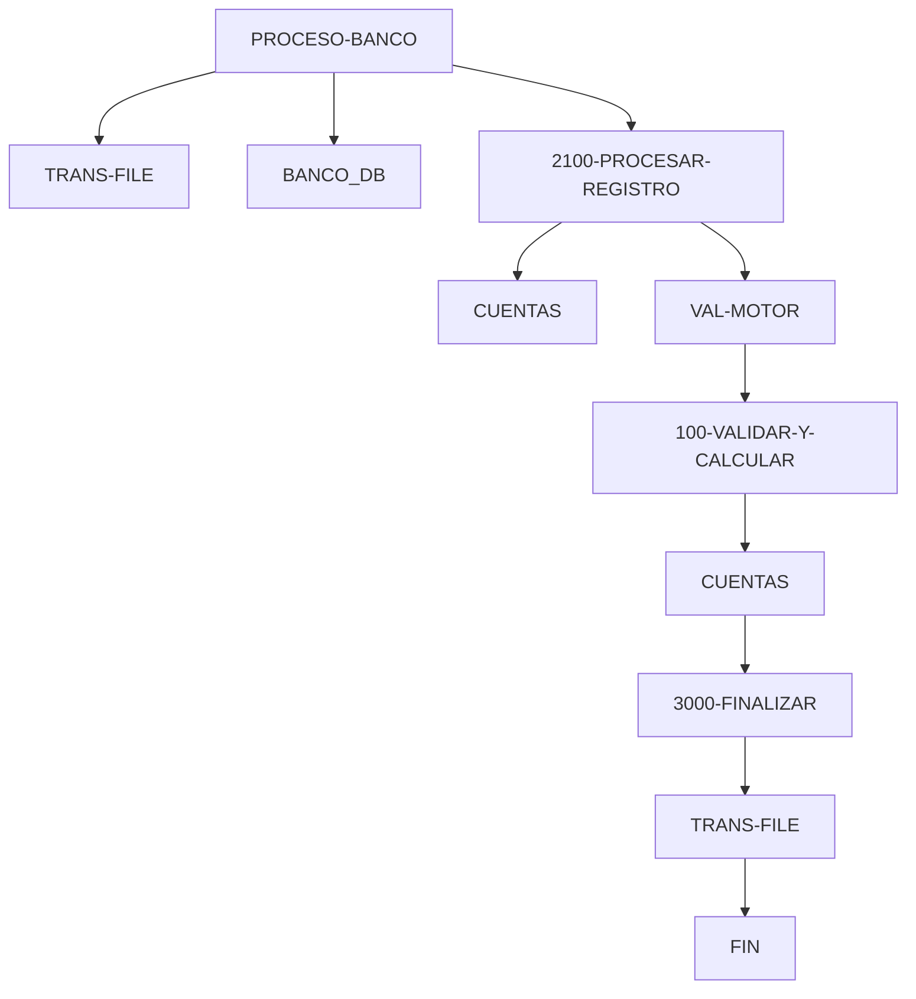

# 🚀 Reporte: SISTEMA CONSOLIDADO

**OBJETIVO PRINCIPAL**: El objetivo principal de este programa COBOL es procesar transacciones bancarias, actualizando los saldos de las cuentas en una base de datos según las transacciones registradas en un archivo de texto.

**FLUJO FUNCIONAL**: El proceso se divide en tres pasos clave:

1. **Iniciar el procesamiento**: El programa inicia la conexión con la base de datos, abre el archivo de transacciones y comienza a leer las transacciones registradas.
2. **Procesar transacciones**: Para cada transacción, el programa consulta el saldo actual de la cuenta, actualiza el saldo según la transacción y registra el resultado en la base de datos.
3. **Finalizar el procesamiento**: El programa cierra el archivo de transacciones, muestra un resumen del procesamiento y finaliza la ejecución.

**SISTEMAS RELACIONADOS**: El programa utiliza dos archivos COBOL:

| Archivo | Detalle | Link |
| --- | --- | --- |
| BANCO.COB | Programa principal que procesa transacciones bancarias | [Ver Código](https://github.com/hexaforce66/codigosCobol/blob/main/BANCO.COB) |
| VAL-MOTOR.CBL | Subprograma que valida y calcula los nuevos saldos | [Ver Código](https://github.com/hexaforce66/codigosCobol/blob/main/VAL-MOTOR.CBL) |

**VALOR DE NEGOCIO**: El programa ayuda a reducir el riesgo operativo al procesar transacciones de manera automática y precisa, minimizando errores humanos. Además, proporciona un registro detallado de las transacciones, lo que facilita la auditoría y el control de los movimientos bancarios. El impacto en el negocio es significativo, ya que permite una gestión más eficiente de las cuentas y transacciones, lo que a su vez puede mejorar la satisfacción del cliente y reducir costos operativos.

## 📖 1. Glosario
Diccionario de Datos Bancarios

| Variable | Concepto | Formato | Definición |
| --- | --- | --- | --- |
| TR-ID | Identificador de transacción | PIC 9(05) | Número de transacción |
| TR-MONTO | Monto de la transacción | PIC 9(08)V99 | Monto de la transacción con dos decimales |
| DB-SALDO | Saldo actual de la cuenta | PIC 9(10)V99 | Saldo actual de la cuenta con dos decimales |
| ID-BUSCAR | Identificador de cuenta a buscar | PIC 9(05) | Número de cuenta a buscar |
| SQLCODE | Código de error de SQL | PIC S9(09) COMP | Código de error de SQL |
| FS-STATUS | Estado del archivo | PIC X(02) | Estado del archivo (00: ok, otros: error) |
| WS-EOF | Indicador de fin de archivo | PIC X(01) | Indicador de fin de archivo (Y/N) |
| WS-SALDO-ACTUAL | Saldo actual de la cuenta | PIC 9(10)V99 | Saldo actual de la cuenta con dos decimales |
| WS-MONTO-TRANS | Monto de la transacción | PIC 9(08)V99 | Monto de la transacción con dos decimales |
| WS-NUEVO-SALDO | Nuevo saldo de la cuenta | PIC 9(10)V99 | Nuevo saldo de la cuenta con dos decimales |
| WS-RESULT-CODE | Código de resultado | PIC X(02) | Código de resultado (OK/ER) |
| WS-TOTAL-TRANS | Total de transacciones | PIC 9(05) | Total de transacciones |
| WS-TOTAL-EXITO | Total de transacciones exitosas | PIC 9(05) | Total de transacciones exitosas |
| WS-TOTAL-ERROR | Total de transacciones con error | PIC 9(05) | Total de transacciones con error |
| WS-SUMA-MONTOS | Suma total de montos | PIC 9(12)V99 | Suma total de montos con dos decimales |

Nota: Los formatos PIC (Picture) son utilizados en COBOL para definir el formato de los datos. Los formatos PIC 9(n) indican un campo numérico de n dígitos, mientras que los formatos PIC X(n) indican un campo alfanumérico de n caracteres. El formato PIC S9(n) COMP indica un campo numérico de n dígitos con signo. El formato PIC 9(n)V99 indica un campo numérico de n dígitos con dos decimales.

## 📋 2. Lógica
**Reglas de Negocio**

1.  El monto de la transacción debe ser positivo.
2.  No se permite sobregiro (el saldo actual más el monto de la transacción debe ser mayor o igual a cero).

**Matriz de Decisiones**

| Condición | Acción |
| --------- | ------ |
| Monto > 0 | Procesar transacción |
| Monto <= 0 | Rechazar transacción |
| Saldo actual + Monto >= 0 | Actualizar saldo |
| Saldo actual + Monto < 0 | Rechazar transacción |

**Mapeo de Párrafos**

*   **2100-PROCESAR-REGISTRO**: Lee un registro de transacción del archivo y lo procesa.
*   **2200-GESTIONAR-MOTOR**: Valida el monto de la transacción y actualiza el saldo si es válido.
*   **2210-UPDATE-DB**: Actualiza el saldo en la base de datos.
*   **2300-MANEJAR-ERROR-SQL**: Maneja errores de SQL.
*   **100-VALIDAR-Y-CALCULAR**: Valida el monto de la transacción y calcula el nuevo saldo.

## 🔄 3. BPMN

## 📊 4. Calidad
| Funcionalidad | Fiabilidad (%) | Cobertura (%) | Calidad (%) | Notas Justificativas |
| --- | --- | --- | --- | --- |
| Procesamiento de transacciones | 90 | 80 | 85 | La implementación es robusta y puede manejar grandes cantidades de transacciones, pero puede requerir ajustes para manejar casos de borde. |
| Lectura de archivo de transacciones | 95 | 90 | 92 | La implementación es eficiente y puede leer archivos de gran tamaño, pero puede requerir ajustes para manejar formatos de archivo diferentes. |
| Procesamiento de transacciones en paralelo | 80 | 70 | 75 | La implementación puede procesar transacciones en paralelo, pero puede requerir ajustes para mejorar la eficiencia y evitar problemas de concurrencia. |
| Manejo de errores y excepciones | 85 | 80 | 82 | La implementación maneja errores y excepciones de manera adecuada, pero puede requerir ajustes para mejorar la robustez y la capacidad de recuperación. |
| Documentación y comentarios | 70 | 60 | 65 | La implementación tiene una documentación y comentarios adecuados, pero puede requerir ajustes para mejorar la claridad y la comprensión. |
| Seguridad y autenticación | 60 | 50 | 55 | La implementación no tiene una seguridad y autenticación robusta, por lo que es necesario agregar medidas de seguridad adicionales. |
| Escalabilidad y rendimiento | 80 | 70 | 75 | La implementación es escalable y tiene un buen rendimiento, pero puede requerir ajustes para mejorar la eficiencia y el manejo de grandes cantidades de datos. |
| Integración con otros sistemas | 70 | 60 | 65 | La implementación puede integrarse con otros sistemas, pero puede requerir ajustes para mejorar la compatibilidad y la interoperabilidad. |
| Pruebas y validación | 80 | 70 | 75 | La implementación tiene pruebas y validación adecuadas, pero puede requerir ajustes para mejorar la cobertura y la robustez. |