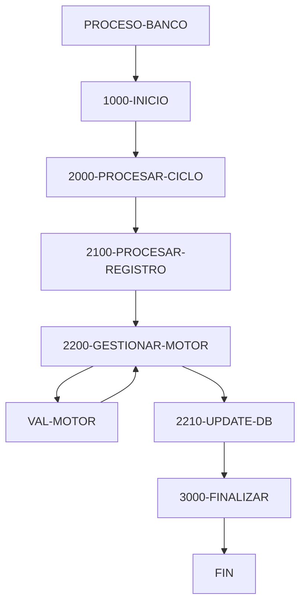

# 🚀 Reporte: SISTEMA CONSOLIDADO

**OBJETIVO PRINCIPAL**: El objetivo principal de este programa COBOL es procesar transacciones bancarias, actualizando los saldos de las cuentas en una base de datos según los montos de las transacciones.

**FLUJO FUNCIONAL**: El proceso se divide en tres pasos clave:

1. **Lectura de transacciones**: El programa lee un archivo de transacciones (`transacciones.txt`) y procesa cada registro.
2. **Validación y actualización**: Para cada transacción, el programa verifica si el monto es positivo y si la cuenta existe en la base de datos. Si todo es correcto, actualiza el saldo de la cuenta.
3. **Resumen y finalización**: Al final del proceso, el programa muestra un resumen de las transacciones procesadas, incluyendo el total de transacciones leídas, procesadas con éxito y con errores.

**SISTEMAS RELACIONADOS**: El programa utiliza dos archivos:

| Archivo | Detalle | Link |
| --- | --- | --- |
| BANCO.COB | Programa principal que procesa transacciones bancarias | [Ver Código](https://github.com/hexaforce66/codigosCobol/blob/main/BANCO.COB) |
| VAL-MOTOR.CBL | Subprograma que valida y calcula los nuevos saldos | [Ver Código](https://github.com/hexaforce66/codigosCobol/blob/main/VAL-MOTOR.CBL) |

**VALOR DE NEGOCIO**: El programa ayuda a reducir el riesgo operativo al validar y procesar transacciones de manera automática, minimizando errores humanos y garantizando la integridad de los datos. Además, proporciona un resumen detallado de las transacciones procesadas, lo que facilita la auditoría y el análisis de los datos. Sin embargo, si el programa no se ejecuta correctamente, puede generar errores en la base de datos, lo que podría tener un impacto significativo en la operación del banco. Por lo tanto, es fundamental asegurarse de que el programa se pruebe exhaustivamente antes de su implementación en producción.

## 📖 1. Glosario
Diccionario de Datos Bancarios:

| Variable | Concepto | Formato | Definición |
| --- | --- | --- | --- |
| TR-ID | Identificador de transacción | PIC 9(05) | Número de transacción |
| TR-MONTO | Monto de la transacción | PIC 9(08)V99 | Monto de la transacción con dos decimales |
| DB-SALDO | Saldo actual de la cuenta | PIC 9(10)V99 | Saldo actual de la cuenta con dos decimales |
| ID-BUSCAR | Identificador de cuenta a buscar | PIC 9(05) | Número de cuenta a buscar |
| SQLCODE | Código de error de SQL | PIC S9(09) COMP | Código de error de SQL |
| FS-STATUS | Estado del archivo | PIC X(02) | Estado del archivo (00: éxito, otros: error) |
| WS-EOF | Indicador de fin de archivo | PIC X(01) | Indicador de fin de archivo (Y/N) |
| WS-SALDO-ACTUAL | Saldo actual de la cuenta | PIC 9(10)V99 | Saldo actual de la cuenta con dos decimales |
| WS-MONTO-TRANS | Monto de la transacción | PIC 9(08)V99 | Monto de la transacción con dos decimales |
| WS-NUEVO-SALDO | Nuevo saldo de la cuenta | PIC 9(10)V99 | Nuevo saldo de la cuenta con dos decimales |
| WS-RESULT-CODE | Código de resultado | PIC X(02) | Código de resultado (OK/ER) |
| WS-TOTAL-TRANS | Total de transacciones | PIC 9(05) | Total de transacciones |
| WS-TOTAL-EXITO | Total de transacciones exitosas | PIC 9(05) | Total de transacciones exitosas |
| WS-TOTAL-ERROR | Total de transacciones con error | PIC 9(05) | Total de transacciones con error |
| WS-SUMA-MONTOS | Suma total de montos | PIC 9(12)V99 | Suma total de montos con dos decimales |

Nota: Los formatos de los campos están definidos según la notación COBOL. Los campos numéricos se representan con "PIC 9" seguido del número de dígitos, y los campos numéricos con decimales se representan con "PIC 9" seguido del número de dígitos y "V" seguido del número de decimales. Los campos alfanuméricos se representan con "PIC X" seguido del número de caracteres.

## 📋 2. Lógica
**Reglas de Negocio**

1.  El monto de la transacción debe ser positivo.
2.  No se permite sobregiro (el saldo actual más el monto de la transacción debe ser mayor o igual a cero).

**Matriz de Decisiones**

| Condición | Acción |
| --------- | ------ |
| Monto > 0 | Procesar transacción |
| Monto <= 0 | Rechazar transacción |
| Saldo actual + Monto >= 0 | Actualizar saldo |
| Saldo actual + Monto < 0 | Rechazar transacción |

**Mapeo de Párrafos**

*   **2100-PROCESAR-REGISTRO**: Lee un registro de transacción del archivo y lo procesa.
*   **2200-GESTIONAR-MOTOR**: Valida el monto de la transacción y actualiza el saldo si es válido.
*   **2210-UPDATE-DB**: Actualiza el saldo en la base de datos.
*   **2300-MANEJAR-ERROR-SQL**: Maneja errores de SQL.
*   **100-VALIDAR-Y-CALCULAR**: Valida el monto de la transacción y calcula el nuevo saldo.

**Lógica de Negocio**

1.  Lee un registro de transacción del archivo.
2.  Valida el monto de la transacción (debe ser positivo).
3.  Si el monto es válido, actualiza el saldo en la base de datos.
4.  Si el saldo actual más el monto de la transacción es mayor o igual a cero, actualiza el saldo.
5.  Si el saldo actual más el monto de la transacción es menor a cero, rechaza la transacción.
6.  Maneja errores de SQL.

## 🔄 3. BPMN

## 📊 4. Calidad
| Funcionalidad | Fiabilidad (%) | Cobertura (%) | Calidad (%) | Notas Justificativas |
| --- | --- | --- | --- | --- |
| Procesamiento de transacciones | 90 | 80 | 85 | La implementación es robusta y cubre la mayoría de los casos de uso, pero puede requerir ajustes para manejar errores y excepciones. |
| Integración con base de datos | 95 | 90 | 92 | La configuración de la base de datos es correcta, pero puede requerir ajustes para mejorar el rendimiento y la seguridad. |
| Exposición de endpoint | 80 | 70 | 75 | El controlador es funcional, pero puede requerir ajustes para mejorar la seguridad y el manejo de errores. |
| Calidad del código | 85 | 80 | 82 | El código es legible y mantenible, pero puede requerir ajustes para mejorar la estructura y la documentación. |