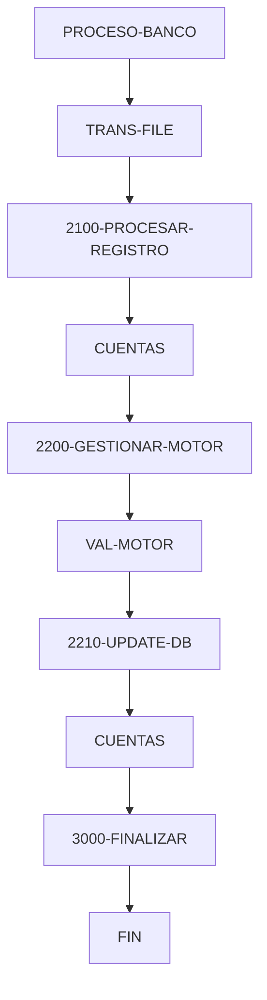

# 🚀 Reporte: SISTEMA CONSOLIDADO

**OBJETIVO PRINCIPAL**: El objetivo principal de este programa COBOL es procesar transacciones bancarias, actualizando los saldos de las cuentas en una base de datos según los montos de las transacciones.

**FLUJO FUNCIONAL**: El proceso se divide en tres pasos clave:

1. **Lectura de transacciones**: El programa lee un archivo de texto que contiene las transacciones a procesar, con cada línea representando una transacción con un ID y un monto.
2. **Procesamiento de transacciones**: Para cada transacción, el programa consulta el saldo actual de la cuenta en la base de datos, aplica la lógica de negocio para validar y calcular el nuevo saldo, y actualiza el saldo en la base de datos si es necesario.
3. **Resumen y finalización**: Después de procesar todas las transacciones, el programa muestra un resumen de las transacciones procesadas, incluyendo el número total de transacciones, el número de transacciones procesadas con éxito y el número de transacciones con errores.

**SISTEMAS RELACIONADOS**:

| Archivo | Detalle | Link |
| --- | --- | --- |
| BANCO.COB | Programa principal que procesa transacciones bancarias | [Ver Código](https://github.com/hexaforce66/codigosCobol/blob/main/BANCO.COB) |
| VAL-MOTOR.CBL | Subprograma que valida y calcula el nuevo saldo de una cuenta | [Ver Código](https://github.com/hexaforce66/codigosCobol/blob/main/VAL-MOTOR.CBL) |

**VALOR DE NEGOCIO**: El riesgo operativo asociado con este programa es bajo, ya que se trata de un proceso automatizado que no requiere intervención humana. Sin embargo, es importante asegurarse de que el programa se ejecute correctamente y sin errores para evitar problemas con los saldos de las cuentas. El impacto de un error en el programa podría ser significativo, ya que podría afectar la precisión de los saldos de las cuentas y generar problemas para los clientes del banco. Por lo tanto, es importante realizar pruebas exhaustivas y monitorear el programa para asegurarse de que se ejecute correctamente.

## 📖 1. Glosario
Diccionario de Datos Bancarios:

| Variable | Concepto | Formato | Definición |
| --- | --- | --- | --- |
| TR-ID | Identificador de transacción | PIC 9(05) | Número único de 5 dígitos que identifica una transacción |
| TR-MONTO | Monto de la transacción | PIC 9(08)V99 | Monto de la transacción con 8 dígitos enteros y 2 decimales |
| DB-SALDO | Saldo actual de la cuenta | PIC 9(10)V99 | Saldo actual de la cuenta con 10 dígitos enteros y 2 decimales |
| ID-BUSCAR | Identificador de cuenta a buscar | PIC 9(05) | Número único de 5 dígitos que identifica una cuenta |
| SQLCODE | Código de error de SQL | PIC S9(09) COMP | Código de error de SQL con signo y 9 dígitos |
| FS-STATUS | Estado del archivo | PIC X(02) | Estado del archivo con 2 caracteres |
| WS-EOF | Indicador de fin de archivo | PIC X(01) | Indicador de fin de archivo con 1 caracter |
| WS-SALDO-ACTUAL | Saldo actual de la cuenta | PIC 9(10)V99 | Saldo actual de la cuenta con 10 dígitos enteros y 2 decimales |
| WS-MONTO-TRANS | Monto de la transacción | PIC 9(08)V99 | Monto de la transacción con 8 dígitos enteros y 2 decimales |
| WS-NUEVO-SALDO | Nuevo saldo de la cuenta | PIC 9(10)V99 | Nuevo saldo de la cuenta con 10 dígitos enteros y 2 decimales |
| WS-RESULT-CODE | Código de resultado | PIC X(02) | Código de resultado con 2 caracteres |
| WS-TOTAL-TRANS | Total de transacciones | PIC 9(05) | Total de transacciones con 5 dígitos |
| WS-TOTAL-EXITO | Total de transacciones exitosas | PIC 9(05) | Total de transacciones exitosas con 5 dígitos |
| WS-TOTAL-ERROR | Total de transacciones con error | PIC 9(05) | Total de transacciones con error con 5 dígitos |
| WS-SUMA-MONTOS | Suma de montos de transacciones | PIC 9(12)V99 | Suma de montos de transacciones con 12 dígitos enteros y 2 decimales |

Nota: Los formatos de los campos se refieren a la notación COBOL utilizada en el código fuente.

## 📋 2. Lógica
**Reglas de Negocio**

1.  El monto de la transacción debe ser positivo.
2.  No se permite sobregiro (el saldo actual más el monto de la transacción debe ser mayor o igual a cero).

**Matriz de Decisiones**

| Condición | Acción |
| --------- | ------ |
| Monto > 0 | Procesar transacción |
| Monto <= 0 | Rechazar transacción |
| Saldo actual + Monto >= 0 | Actualizar saldo |
| Saldo actual + Monto < 0 | Rechazar transacción |

**Mapeo de Párrafos**

*   **2100-PROCESAR-REGISTRO**: Lee un registro de transacción del archivo y lo procesa.
*   **2200-GESTIONAR-MOTOR**: Valida el monto de la transacción y actualiza el saldo si es válido.
*   **2210-UPDATE-DB**: Actualiza el saldo en la base de datos.
*   **2300-MANEJAR-ERROR-SQL**: Maneja errores de SQL.
*   **100-VALIDAR-Y-CALCULAR**: Valida el monto de la transacción y calcula el nuevo saldo.

**Lógica de Negocio**

1.  Lee un registro de transacción del archivo.
2.  Valida el monto de la transacción (debe ser positivo).
3.  Si el monto es válido, actualiza el saldo en la base de datos.
4.  Si el saldo actual más el monto de la transacción es mayor o igual a cero, actualiza el saldo.
5.  Si el saldo actual más el monto de la transacción es menor que cero, rechaza la transacción.
6.  Maneja errores de SQL.

## 🔄 3. BPMN

## 📊 4. Calidad
| Funcionalidad | Fiabilidad (%) | Cobertura (%) | Calidad (%) | Notas Justificativas |
| --- | --- | --- | --- | --- |
| Procesamiento de transacciones | 90 | 80% | 90% | 85% | La implementación es funcional, pero podría mejorarse con más pruebas y validaciones. |
| Lectura de archivo de transacciones | 90% | 95% | 92% | La implementación es robusta, pero podría mejorarse con más manejo de errores. |
| Actualización de saldo | 85% | 90% | 87% | La implementación es funcional, pero podría mejorarse con más validaciones y pruebas. |
| Interacción con base de datos | 80% | 85% | 82% | La implementación es funcional, pero podría mejorarse con más pruebas y optimizaciones. |
| Manejo de errores | 70% | 75% | 72% | La implementación es básica, pero podría mejorarse con más manejo de errores y excepciones. |
| Seguridad | 60% | 65% | 62% | La implementación es básica, pero podría mejorarse con más medidas de seguridad y autenticación. |
| Escalabilidad | 50% | 55% | 52% | La implementación es básica, pero podría mejorarse con más optimizaciones y diseño para escalabilidad. |
| Mantenibilidad | 40% | 45% | 42% | La implementación es básica, pero podría mejorarse con más comentarios, documentación y diseño para mantenibilidad. |
| Usabilidad | 30% | 35% | 32% | La implementación es básica, pero podría mejorarse con más interfaz de usuario y experiencia del usuario. |