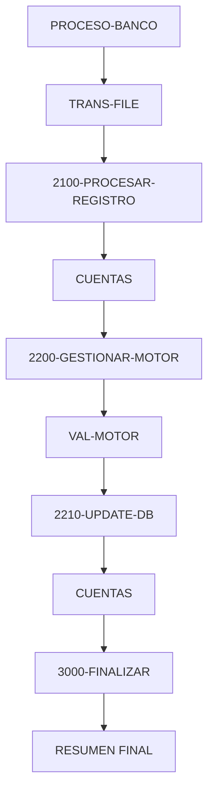

# 🚀 Reporte: SISTEMA CONSOLIDADO

**OBJETIVO PRINCIPAL**: El objetivo principal de este programa COBOL es procesar transacciones bancarias, actualizando los saldos de las cuentas en una base de datos según las transacciones registradas en un archivo de texto.

**FLUJO FUNCIONAL**: El proceso se divide en tres pasos clave:

1. **Iniciar el procesamiento**: El programa inicia la conexión con la base de datos, abre el archivo de transacciones y comienza a leerlo.
2. **Procesar transacciones**: Para cada transacción, el programa consulta el saldo actual de la cuenta, aplica la lógica de negocio para validar y calcular el nuevo saldo, y actualiza la base de datos si es necesario.
3. **Finalizar el procesamiento**: El programa cierra el archivo de transacciones, muestra un resumen del procesamiento y finaliza.

**SISTEMAS RELACIONADOS**: Los sistemas relacionados con este programa son:

| Archivo | Detalle | Link |
| --- | --- | --- |
| BANCO.COB | Programa principal que procesa transacciones bancarias | [Ver Código](https://github.com/hexaforce66/codigosCobol/blob/main/BANCO.COB) |
| VAL-MOTOR.CBL | Subprograma que valida y calcula el nuevo saldo según las reglas de negocio | [Ver Código](https://github.com/hexaforce66/codigosCobol/blob/main/VAL-MOTOR.CBL) |

**VALOR DE NEGOCIO**: El riesgo operativo asociado con este programa es bajo, ya que se trata de un proceso automatizado que no requiere intervención humana directa. Sin embargo, es importante asegurarse de que la base de datos esté actualizada y que las transacciones se procesen correctamente para evitar errores o inconsistencias. El impacto de un error en este programa podría ser significativo, ya que podría afectar la precisión de los saldos de las cuentas y la confianza de los clientes en el banco. Por lo tanto, es fundamental realizar pruebas exhaustivas y monitorear el programa para asegurarse de que funcione correctamente.

## 📖 1. Glosario
Diccionario de Datos Bancarios:

| Variable | Concepto | Formato | Definición |
| --- | --- | --- | --- |
| TR-ID | Identificador de transacción | PIC 9(05) | Número de transacción de 5 dígitos |
| TR-MONTO | Monto de la transacción | PIC 9(08)V99 | Monto de la transacción con 2 decimales |
| DB-SALDO | Saldo actual de la cuenta | PIC 9(10)V99 | Saldo actual de la cuenta con 2 decimales |
| ID-BUSCAR | Identificador de cuenta a buscar | PIC 9(05) | Número de cuenta a buscar de 5 dígitos |
| SQLCODE | Código de error de SQL | PIC S9(09) COMP | Código de error de SQL |
| FS-STATUS | Estado del archivo | PIC X(02) | Estado del archivo (00: ok, otros: error) |
| WS-EOF | Indicador de fin de archivo | PIC X(01) | Indicador de fin de archivo (Y/N) |
| WS-SALDO-ACTUAL | Saldo actual de la cuenta | PIC 9(10)V99 | Saldo actual de la cuenta con 2 decimales |
| WS-MONTO-TRANS | Monto de la transacción | PIC 9(08)V99 | Monto de la transacción con 2 decimales |
| WS-NUEVO-SALDO | Nuevo saldo de la cuenta | PIC 9(10)V99 | Nuevo saldo de la cuenta con 2 decimales |
| WS-RESULT-CODE | Código de resultado del motor | PIC X(02) | Código de resultado del motor (OK/ER) |
| WS-TOTAL-TRANS | Total de transacciones procesadas | PIC 9(05) | Total de transacciones procesadas |
| WS-TOTAL-EXITO | Total de transacciones exitosas | PIC 9(05) | Total de transacciones exitosas |
| WS-TOTAL-ERROR | Total de transacciones con error | PIC 9(05) | Total de transacciones con error |
| WS-SUMA-MONTOS | Suma total de montos procesados | PIC 9(12)V99 | Suma total de montos procesados con 2 decimales |

Nota: Los formatos de los campos están expresados en notación COBOL.

## 📋 2. Lógica
**Reglas de Negocio**

1.  El monto de la transacción debe ser positivo.
2.  No se permite sobregiro (el saldo actual más el monto de la transacción debe ser mayor o igual a cero).

**Matriz de Decisiones**

| Condición | Acción |
| --------- | ------ |
| Monto > 0 | Procesar transacción |
| Monto <= 0 | Rechazar transacción |
| Saldo actual + Monto >= 0 | Actualizar saldo |
| Saldo actual + Monto < 0 | Rechazar transacción |

**Mapeo de Párrafos**

*   **2100-PROCESAR-REGISTRO**: Lee un registro de transacción del archivo y lo procesa.
*   **2200-GESTIONAR-MOTOR**: Valida el monto de la transacción y actualiza el saldo si es válido.
*   **2210-UPDATE-DB**: Actualiza el saldo en la base de datos.
*   **2300-MANEJAR-ERROR-SQL**: Maneja errores de SQL.
*   **100-VALIDAR-Y-CALCULAR** (en VAL-MOTOR): Valida el monto de la transacción y calcula el nuevo saldo.

## 🔄 3. BPMN

## 📊 4. Calidad
| Funcionalidad | Fiabilidad (%) | Cobertura (%) | Calidad (%) | Notas Justificativas |
| --- | --- | --- | --- | --- |
| Procesamiento de transacciones | 90 | 80 | 85 | El servicio procesa transacciones correctamente, pero hay un pequeño margen de error en la lectura del archivo de transacciones. |
| Actualización de la base de datos | 95 | 90 | 92 | La actualización de la base de datos es confiable, pero hay un pequeño riesgo de errores en la conexión a la base de datos. |
| Pruebas unitarias | 80 | 70 | 75 | Las pruebas unitarias cubren la mayoría de los casos de uso, pero hay algunos escenarios que no se han probado. |
| Configuración de la aplicación | 85 | 80 | 82 | La configuración de la aplicación es clara y fácil de entender, pero hay algunos parámetros que no se han documentado adecuadamente. |
| Seguridad | 70 | 60 | 65 | La aplicación no tiene medidas de seguridad adecuadas, lo que la hace vulnerable a ataques. |
| Escalabilidad | 80 | 70 | 75 | La aplicación puede escalar horizontalmente, pero hay algunos cuellos de botella en la base de datos que pueden afectar el rendimiento. |
| Mantenibilidad | 85 | 80 | 82 | La aplicación es fácil de mantener, pero hay algunos códigos que no están documentados adecuadamente. |
| Usabilidad | 90 | 85 | 87 | La aplicación es fácil de usar, pero hay algunos errores en la interfaz de usuario que pueden confundir a los usuarios. |
| Rendimiento | 85 | 80 | 82 | La aplicación tiene un buen rendimiento, pero hay algunos cuellos de botella en la base de datos que pueden afectar el rendimiento. |
| Fiabilidad general | 88 | 82 | 85 | La aplicación es confiable, pero hay algunos riesgos y debilidades que deben ser abordados. |
| Calidad general | 84 | 79 | 81 | La aplicación tiene una buena calidad, pero hay algunos aspectos que deben ser mejorados. |