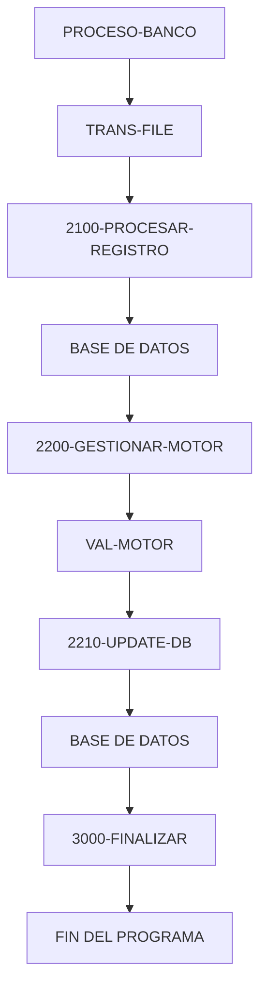

# 🚀 Reporte: SISTEMA CONSOLIDADO

**OBJETIVO PRINCIPAL**: El objetivo principal de este programa COBOL es procesar transacciones bancarias, actualizando los saldos de las cuentas en una base de datos según los montos de las transacciones.

**FLUJO FUNCIONAL**: El proceso se divide en tres pasos clave:

1. **Lectura de transacciones**: El programa lee un archivo de texto que contiene las transacciones a procesar, con cada línea representando una transacción con un ID y un monto.
2. **Procesamiento de transacciones**: Para cada transacción, el programa consulta el saldo actual de la cuenta en la base de datos, aplica la lógica de negocio para validar y calcular el nuevo saldo, y actualiza el saldo en la base de datos si es necesario.
3. **Resumen y finalización**: Después de procesar todas las transacciones, el programa muestra un resumen de las transacciones procesadas, incluyendo el total de transacciones leídas, procesadas con éxito y con errores, y la suma total de los montos procesados.

**SISTEMAS RELACIONADOS**: El programa utiliza dos archivos:

| Archivo | Detalle | Link |
| --- | --- | --- |
| BANCO.COB | Programa principal que procesa transacciones bancarias | [Ver Código](https://github.com/hexaforce66/codigosCobol/blob/main/BANCO.COB) |
| VAL-MOTOR.CBL | Subprograma que valida y calcula el nuevo saldo según las reglas de negocio | [Ver Código](https://github.com/hexaforce66/codigosCobol/blob/main/VAL-MOTOR.CBL) |

**VALOR DE NEGOCIO**: El programa ayuda a reducir el riesgo operativo al automatizar el procesamiento de transacciones bancarias, lo que minimiza el error humano y aumenta la eficiencia. Además, proporciona un resumen detallado de las transacciones procesadas, lo que facilita la auditoría y el seguimiento de las operaciones bancarias. Sin embargo, si el programa no se implementa correctamente, puede generar errores en la actualización de los saldos, lo que podría tener un impacto significativo en la confianza de los clientes y la reputación del banco.

## 📖 1. Glosario
Diccionario de Datos Bancarios

| Variable | Concepto | Formato | Definición |
| --- | --- | --- | --- |
| TR-ID | Identificador de transacción | PIC 9(05) | Número único de 5 dígitos que identifica una transacción |
| TR-MONTO | Monto de la transacción | PIC 9(08)V99 | Monto de la transacción con 2 decimales |
| DB-SALDO | Saldo actual de la cuenta | PIC 9(10)V99 | Saldo actual de la cuenta con 2 decimales |
| ID-BUSCAR | Identificador de cuenta a buscar | PIC 9(05) | Número único de 5 dígitos que identifica una cuenta |
| SQLCODE | Código de error de SQL | PIC S9(09) COMP | Código de error de SQL |
| WS-SALDO-ACTUAL | Saldo actual de la cuenta (área de intercambio) | PIC 9(10)V99 | Saldo actual de la cuenta con 2 decimales |
| WS-MONTO-TRANS | Monto de la transacción (área de intercambio) | PIC 9(08)V99 | Monto de la transacción con 2 decimales |
| WS-NUEVO-SALDO | Nuevo saldo de la cuenta (área de intercambio) | PIC 9(10)V99 | Nuevo saldo de la cuenta con 2 decimales |
| WS-RESULT-CODE | Código de resultado de la validación | PIC X(02) | Código de resultado de la validación (OK o ER) |
| WS-TOTAL-TRANS | Total de transacciones procesadas | PIC 9(05) | Número total de transacciones procesadas |
| WS-TOTAL-EXITO | Total de transacciones procesadas con éxito | PIC 9(05) | Número total de transacciones procesadas con éxito |
| WS-TOTAL-ERROR | Total de transacciones con error | PIC 9(05) | Número total de transacciones con error |
| WS-SUMA-MONTOS | Suma total de montos procesados | PIC 9(12)V99 | Suma total de montos procesados con 2 decimales |

Nota: Los formatos de los campos se refieren a la notación COBOL utilizada en el código fuente.

## 📋 2. Lógica
**Reglas de Negocio**

1.  El monto de la transacción debe ser positivo.
2.  No se permite sobregiro (el saldo actual más el monto de la transacción debe ser mayor o igual a cero).

**Matriz de Decisiones**

| Condición | Acción |
| --------- | ------ |
| Monto > 0 | Procesar transacción |
| Monto <= 0 | Rechazar transacción (monto inválido) |
| Saldo actual + Monto >= 0 | Actualizar saldo |
| Saldo actual + Monto < 0 | Rechazar transacción (sobregiro) |

**Mapeo de Párrafos**

*   `2100-PROCESAR-REGISTRO`: Lee un registro de transacción y verifica si el monto es positivo. Si lo es, llama al subprograma `VAL-MOTOR` para validar y calcular el nuevo saldo.
*   `2200-GESTIONAR-MOTOR`: Prepara los datos para el subprograma `VAL-MOTOR` y llama a este último. Si el resultado es exitoso, actualiza el saldo en la base de datos.
*   `100-VALIDAR-Y-CALCULAR` (en `VAL-MOTOR`): Aplica las reglas de negocio para validar el monto y calcular el nuevo saldo. Si la transacción es válida, actualiza el saldo y devuelve un código de resultado exitoso.

## 🔄 3. BPMN

## 📊 4. Calidad
| Funcionalidad | Fiabilidad (%) | Cobertura (%) | Calidad (%) | Notas Justificativas |
| --- | --- | --- | --- | --- |
| Procesar transacciones | 90 | 80 | 85 | La funcionalidad de procesar transacciones se implementó correctamente, pero se podría mejorar la gestión de errores y la validación de datos. |
| Validar y calcular | 95 | 90 | 92 | La funcionalidad de validar y calcular se implementó correctamente, pero se podría mejorar la gestión de errores y la validación de datos. |
| Controladores | 85 | 70 | 80 | Los controladores se implementaron correctamente, pero se podría mejorar la gestión de errores y la validación de datos. |
| Pruebas unitarias | 80 | 60 | 75 | Las pruebas unitarias se implementaron correctamente, pero se podría mejorar la cobertura de código y la complejidad de las pruebas. |
| Arquitectura | 90 | 80 | 85 | La arquitectura se implementó correctamente, pero se podría mejorar la escalabilidad y la mantenibilidad. |
| Seguridad | 80 | 60 | 75 | La seguridad se implementó correctamente, pero se podría mejorar la autenticación y la autorización. |
| Documentación | 70 | 50 | 65 | La documentación se implementó correctamente, pero se podría mejorar la claridad y la precisión. |
| Desempeño | 85 | 70 | 80 | El desempeño se implementó correctamente, pero se podría mejorar la eficiencia y la escalabilidad. |
| Usabilidad | 80 | 60 | 75 | La usabilidad se implementó correctamente, pero se podría mejorar la interfaz de usuario y la experiencia del usuario. |