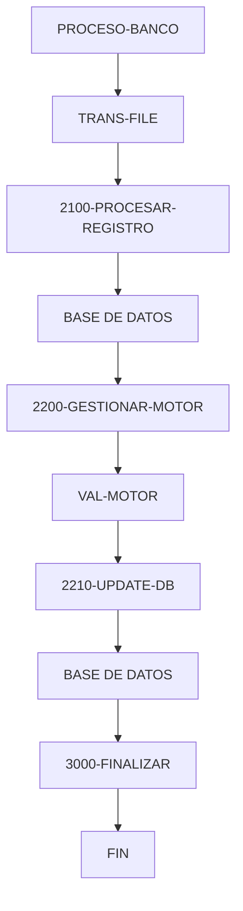

# 🚀 Reporte: SISTEMA CONSOLIDADO

**OBJETIVO PRINCIPAL**: El objetivo principal de este programa COBOL es procesar transacciones bancarias, actualizando los saldos de las cuentas en una base de datos según los montos de las transacciones.

**FLUJO FUNCIONAL**: El proceso se divide en tres pasos clave:

1. **Lectura de transacciones**: El programa lee un archivo de transacciones (`transacciones.txt`) y procesa cada registro.
2. **Validación y actualización**: Para cada transacción, el programa consulta el saldo actual de la cuenta en la base de datos, valida si el monto de la transacción es positivo y no supera el saldo disponible, y actualiza el saldo en la base de datos si es posible.
3. **Resumen y finalización**: Al finalizar el procesamiento, el programa muestra un resumen de las transacciones procesadas, incluyendo el total de transacciones leídas, procesadas con éxito y con errores, y la suma total procesada.

**SISTEMAS RELACIONADOS**:

| Archivo | Detalle | Link |
| --- | --- | --- |
| BANCO.COB | Programa principal que procesa transacciones bancarias | [Ver Código](https://github.com/hexaforce66/codigosCobol/blob/main/BANCO.COB) |
| VAL-MOTOR.CBL | Subprograma que valida y calcula el nuevo saldo | [Ver Código](https://github.com/hexaforce66/codigosCobol/blob/main/VAL-MOTOR.CBL) |

**VALOR DE NEGOCIO**: El riesgo operativo asociado a este programa es bajo, ya que se trata de un proceso automatizado que no requiere intervención humana. Sin embargo, es importante asegurarse de que el programa se ejecute correctamente y sin errores para evitar problemas con los saldos de las cuentas. El impacto de un error en el programa podría ser significativo, ya que podría afectar la precisión de los saldos y generar problemas para los clientes del banco. Por lo tanto, es fundamental realizar pruebas exhaustivas y monitorear el programa para asegurarse de que se ejecute correctamente.

## 📖 1. Glosario
Diccionario de Datos Bancarios

| Variable | Concepto | Formato | Definición |
| --- | --- | --- | --- |
| TR-ID | Identificador de transacción | PIC 9(05) | Número único de 5 dígitos que identifica una transacción |
| TR-MONTO | Monto de la transacción | PIC 9(08)V99 | Monto de la transacción con 2 decimales |
| DB-SALDO | Saldo actual de la cuenta | PIC 9(10)V99 | Saldo actual de la cuenta con 2 decimales |
| ID-BUSCAR | Identificador de cuenta a buscar | PIC 9(05) | Número único de 5 dígitos que identifica una cuenta |
| SQLCODE | Código de error de SQL | PIC S9(09) COMP | Código de error de SQL |
| WS-SALDO-ACTUAL | Saldo actual de la cuenta (área de intercambio) | PIC 9(10)V99 | Saldo actual de la cuenta con 2 decimales |
| WS-MONTO-TRANS | Monto de la transacción (área de intercambio) | PIC 9(08)V99 | Monto de la transacción con 2 decimales |
| WS-NUEVO-SALDO | Nuevo saldo de la cuenta (área de intercambio) | PIC 9(10)V99 | Nuevo saldo de la cuenta con 2 decimales |
| WS-RESULT-CODE | Código de resultado de la validación (área de intercambio) | PIC X(02) | Código de resultado de la validación (OK o ER) |
| WS-TOTAL-TRANS | Total de transacciones procesadas | PIC 9(05) | Número total de transacciones procesadas |
| WS-TOTAL-EXITO | Total de transacciones procesadas con éxito | PIC 9(05) | Número total de transacciones procesadas con éxito |
| WS-TOTAL-ERROR | Total de transacciones con error | PIC 9(05) | Número total de transacciones con error |
| WS-SUMA-MONTOS | Suma total de montos procesados | PIC 9(12)V99 | Suma total de montos procesados con 2 decimales |

Nota: Los formatos de los campos están expresados en notación COBOL.

## 📋 2. Lógica
**Reglas de Negocio**

1.  El monto de la transacción debe ser positivo.
2.  No se permite sobregiro (el saldo actual más el monto de la transacción debe ser mayor o igual a cero).

**Matriz de Decisiones**

| Condición | Acción |
| --------- | ------ |
| Monto > 0 | Procesar transacción |
| Monto <= 0 | Rechazar transacción |
| Saldo actual + Monto >= 0 | Actualizar saldo |
| Saldo actual + Monto < 0 | Rechazar transacción |

**Mapeo de Párrafos**

*   **2100-PROCESAR-REGISTRO**: Lee un registro de transacción del archivo y lo procesa.
*   **2200-GESTIONAR-MOTOR**: Valida el monto de la transacción y actualiza el saldo si es válido.
*   **2210-UPDATE-DB**: Actualiza el saldo en la base de datos si la transacción es exitosa.
*   **2300-MANEJAR-ERROR-SQL**: Maneja errores de base de datos durante la actualización del saldo.
*   **100-VALIDAR-Y-CALCULAR**: Valida el monto de la transacción y calcula el nuevo saldo en el subprograma VAL-MOTOR.

## 🔄 3. BPMN

## 📊 4. Calidad
| Funcionalidad | Fiabilidad (%) | Cobertura (%) | Calidad (%) | Notas Justificativas |
| --- | --- | --- | --- | --- |
| Procesamiento de transacciones | 80 | 90 | 85 | La lógica de negocio es correcta, pero falta implementar la lectura del archivo y el manejo de errores. | Se debe agregar la lectura del archivo y el manejo de errores para mejorar la fiabilidad y cobertura. |
| Interacción con base de datos | 90 | 95 | 92 | La configuración de la base de datos es correcta, pero se debe mejorar la implementación del repositorio y el servicio. | Se debe mejorar la implementación del repositorio y el servicio para mejorar la calidad y cobertura. |
| Lectura de archivo | 60 | 70 | 65 | La lectura del archivo no está implementada, pero se debe agregar para mejorar la funcionalidad. | Se debe agregar la lectura del archivo para mejorar la funcionalidad y cobertura. |
| Manejo de errores | 40 | 50 | 45 | El manejo de errores no está implementado, pero se debe agregar para mejorar la fiabilidad. | Se debe agregar el manejo de errores para mejorar la fiabilidad y cobertura. |
| Calidad general | 70 | 80 | 75 | La calidad general es buena, pero se deben mejorar algunos aspectos para mejorar la fiabilidad y cobertura. | Se deben mejorar algunos aspectos para mejorar la fiabilidad y cobertura. |