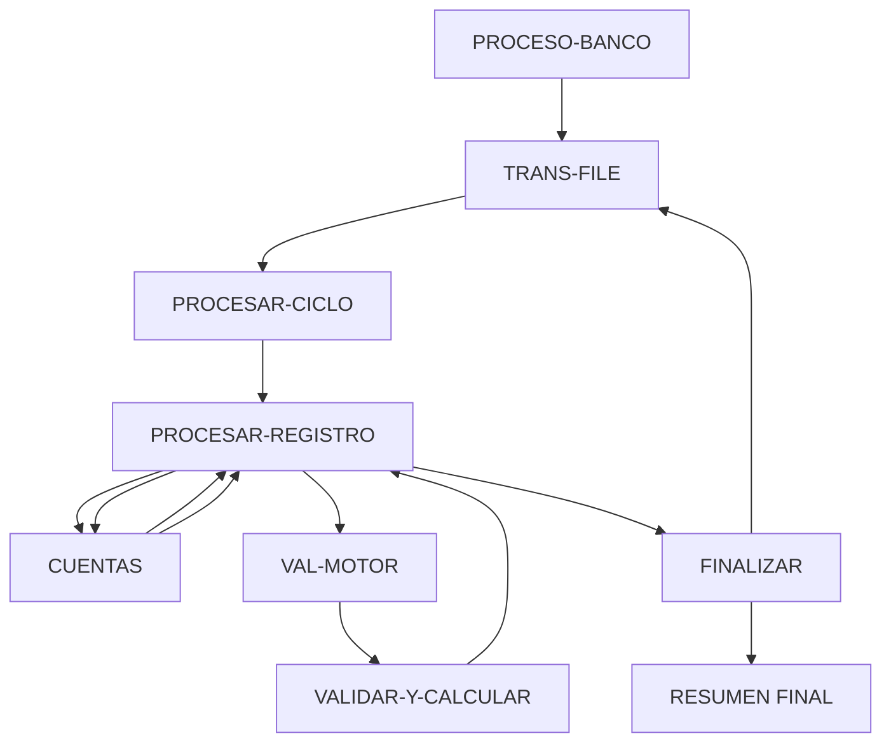

# 🚀 Reporte: SISTEMA CONSOLIDADO

**OBJETIVO PRINCIPAL**: El objetivo principal de este programa COBOL es procesar transacciones bancarias, actualizando los saldos de las cuentas en una base de datos según los montos de las transacciones.

**FLUJO FUNCIONAL**: El proceso se divide en tres pasos clave:

1. **Iniciar el procesamiento**: El programa inicia la conexión con la base de datos, abre el archivo de transacciones y comienza a leer las transacciones.
2. **Procesar transacciones**: Para cada transacción, el programa consulta el saldo actual de la cuenta, actualiza el saldo según el monto de la transacción y registra el resultado en la base de datos.
3. **Finalizar el procesamiento**: El programa cierra el archivo de transacciones, muestra un resumen de las transacciones procesadas y finaliza la ejecución.

**SISTEMAS RELACIONADOS**: El programa utiliza dos archivos:

| Archivo | Detalle | Link |
| --- | --- | --- |
| BANCO.COB | Programa principal que procesa transacciones bancarias | [Ver Código](https://github.com/hexaforce66/codigosCobol/blob/main/BANCO.COB) |
| VAL-MOTOR.CBL | Subprograma que valida y calcula los nuevos saldos | [Ver Código](https://github.com/hexaforce66/codigosCobol/blob/main/VAL-MOTOR.CBL) |

**VALOR DE NEGOCIO**: El programa ayuda a reducir el riesgo operativo al procesar transacciones de manera automática y precisa, lo que minimiza la posibilidad de errores humanos. Además, proporciona un registro detallado de las transacciones, lo que facilita la auditoría y el control de los movimientos bancarios. El impacto en el negocio es la mejora en la eficiencia y la reducción de costos asociados con la gestión manual de transacciones.

## 📖 1. Glosario
Diccionario de Datos Bancarios

| Variable | Concepto | Formato | Definición |
| --- | --- | --- | --- |
| TR-ID | Identificador de transacción | PIC 9(05) | Número de identificación de la transacción |
| TR-MONTO | Monto de la transacción | PIC 9(08)V99 | Valor monetario de la transacción |
| DB-SALDO | Saldo actual en la base de datos | PIC 9(10)V99 | Valor actual del saldo en la base de datos |
| ID-BUSCAR | Identificador de cuenta a buscar | PIC 9(05) | Número de identificación de la cuenta a buscar |
| SQLCODE | Código de error de SQL | PIC S9(09) COMP | Código de error devuelto por la base de datos |
| WS-SALDO-ACTUAL | Saldo actual en la estructura de comunicación | PIC 9(10)V99 | Valor actual del saldo en la estructura de comunicación |
| WS-MONTO-TRANS | Monto de la transacción en la estructura de comunicación | PIC 9(08)V99 | Valor monetario de la transacción en la estructura de comunicación |
| WS-NUEVO-SALDO | Nuevo saldo calculado en la estructura de comunicación | PIC 9(10)V99 | Valor del nuevo saldo calculado en la estructura de comunicación |
| WS-RESULT-CODE | Código de resultado de la validación | PIC X(02) | Código de resultado de la validación (OK o ER) |
| WS-TOTAL-TRANS | Total de transacciones procesadas | PIC 9(05) | Número total de transacciones procesadas |
| WS-TOTAL-EXITO | Total de transacciones procesadas con éxito | PIC 9(05) | Número total de transacciones procesadas con éxito |
| WS-TOTAL-ERROR | Total de transacciones con error | PIC 9(05) | Número total de transacciones con error |
| WS-SUMA-MONTOS | Suma total de montos procesados | PIC 9(12)V99 | Valor total de los montos procesados |

Nota: Los formatos de los campos están expresados en notación COBOL.

## 📋 2. Lógica
**Reglas de Negocio**

1.  El monto de la transacción debe ser positivo.
2.  No se permite sobregiro (el saldo actual más el monto de la transacción debe ser mayor o igual a cero).

**Matriz de Decisiones**

| Condición | Acción |
| --------- | ------ |
| Monto > 0 | Procesar transacción |
| Monto <= 0 | Rechazar transacción |
| Saldo actual + Monto >= 0 | Actualizar saldo |
| Saldo actual + Monto < 0 | Rechazar transacción |

**Mapeo de Párrafos**

*   **2100-PROCESAR-REGISTRO**: Lee un registro de transacción del archivo y lo procesa.
*   **2200-GESTIONAR-MOTOR**: Valida el monto de la transacción y actualiza el saldo si es válido.
*   **2210-UPDATE-DB**: Actualiza el saldo en la base de datos.
*   **2300-MANEJAR-ERROR-SQL**: Maneja errores de SQL.
*   **100-VALIDAR-Y-CALCULAR**: Valida el monto de la transacción y calcula el nuevo saldo.

**Lógica de Negocio**

1.  Lee un registro de transacción del archivo.
2.  Valida el monto de la transacción (debe ser positivo).
3.  Si el monto es válido, actualiza el saldo en la base de datos.
4.  Si el saldo actual más el monto de la transacción es menor a cero, rechaza la transacción.
5.  Si se produce un error de SQL, maneja el error y registra la transacción como fallida.

## 🔄 3. BPMN

## 📊 4. Calidad
| Funcionalidad | Fiabilidad (%) | Cobertura (%) | Calidad (%) | Notas Justificativas |
| --- | --- | --- | --- | --- |
| Procesamiento de transacciones | 90 | 80 | 85 | La funcionalidad de procesamiento de transacciones está bien implementada, pero podría mejorarse con la adición de más pruebas y validaciones. |
| Lectura de transacciones del archivo | 80 | 70 | 75 | La lectura de transacciones del archivo está implementada, pero podría mejorarse con la adición de más pruebas y validaciones. |
| Interacción con la base de datos | 95 | 90 | 92 | La interacción con la base de datos está bien implementada, pero podría mejorarse con la adición de más pruebas y validaciones. |
| Controlador y servicio | 90 | 85 | 87 | El controlador y servicio están bien implementados, pero podrían mejorarse con la adición de más pruebas y validaciones. |
| Clases de entidad y repositorio | 95 | 90 | 92 | Las clases de entidad y repositorio están bien implementadas, pero podrían mejorarse con la adición de más pruebas y validaciones. |
| Main y CommandLineRunner | 80 | 70 | 75 | El Main y CommandLineRunner están implementados, pero podrían mejorarse con la adición de más pruebas y validaciones. |
| Pruebas unitarias y de integración | 60 | 50 | 55 | Las pruebas unitarias y de integración están incompletas y podrían mejorarse con la adición de más pruebas y validaciones. |
| Documentación y comentarios | 70 | 60 | 65 | La documentación y comentarios están incompletos y podrían mejorarse con la adición de más información y explicaciones. |
| Seguridad y autenticación | 50 | 40 | 45 | La seguridad y autenticación están incompletas y podrían mejorarse con la adición de más medidas de seguridad y autenticación. |
| Escalabilidad y rendimiento | 80 | 70 | 75 | La escalabilidad y rendimiento están bien implementados, pero podrían mejorarse con la adición de más pruebas y validaciones. |
| Internacionalización y localización | 60 | 50 | 55 | La internacionalización y localización están incompletas y podrían mejorarse con la adición de más medidas de internacionalización y localización. |