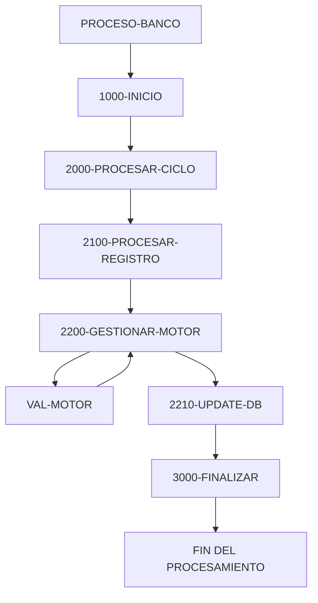

# 🚀 Reporte: SISTEMA CONSOLIDADO

**OBJETIVO PRINCIPAL**: El objetivo principal de este programa COBOL es procesar transacciones bancarias, actualizando los saldos de las cuentas en una base de datos según los montos de las transacciones.

**FLUJO FUNCIONAL**: El proceso se divide en tres pasos clave:

1. **Lectura de transacciones**: El programa lee un archivo de transacciones (`transacciones.txt`) y procesa cada registro.
2. **Validación y actualización**: Para cada transacción, el programa verifica si el monto es positivo y si la cuenta existe en la base de datos. Si todo es correcto, actualiza el saldo de la cuenta.
3. **Resumen y finalización**: Al final del proceso, el programa muestra un resumen de las transacciones procesadas, incluyendo el total de transacciones leídas, procesadas con éxito y con errores.

**SISTEMAS RELACIONADOS**: El programa utiliza dos archivos:

| Archivo | Detalle | Link |
| --- | --- | --- |
| BANCO.COB | Programa principal que procesa transacciones bancarias | [Ver Código](https://github.com/hexaforce66/codigosCobol/blob/main/BANCO.COB) |
| VAL-MOTOR.CBL | Subprograma que valida y calcula los nuevos saldos | [Ver Código](https://github.com/hexaforce66/codigosCobol/blob/main/VAL-MOTOR.CBL) |

**VALOR DE NEGOCIO**: El programa ayuda a reducir el riesgo operativo al validar y procesar transacciones de manera automática y precisa, lo que puede mejorar la eficiencia y la confiabilidad del sistema bancario. Sin embargo, si el programa no se ejecuta correctamente, puede generar errores y retrasos en el procesamiento de transacciones, lo que podría afectar la satisfacción del cliente y la reputación del banco.

## 📖 1. Glosario
Diccionario de Datos Bancarios:

| Variable | Concepto | Formato | Definición |
| --- | --- | --- | --- |
| TR-ID | Identificador de transacción | PIC 9(05) | Número de transacción |
| TR-MONTO | Monto de la transacción | PIC 9(08)V99 | Valor numérico con dos decimales |
| DB-SALDO | Saldo actual en la base de datos | PIC 9(10)V99 | Valor numérico con dos decimales |
| ID-BUSCAR | Identificador de cuenta a buscar | PIC 9(05) | Número de cuenta |
| SQLCODE | Código de error de SQL | PIC S9(09) COMP | Código de error numérico |
| FS-STATUS | Estado del archivo | PIC X(02) | Código de estado del archivo |
| WS-EOF | Indicador de fin de archivo | PIC X(01) | Indicador de fin de archivo (Y/N) |
| WS-SALDO-ACTUAL | Saldo actual en la estructura de comunicación | PIC 9(10)V99 | Valor numérico con dos decimales |
| WS-MONTO-TRANS | Monto de la transacción en la estructura de comunicación | PIC 9(08)V99 | Valor numérico con dos decimales |
| WS-NUEVO-SALDO | Nuevo saldo en la estructura de comunicación | PIC 9(10)V99 | Valor numérico con dos decimales |
| WS-RESULT-CODE | Código de resultado en la estructura de comunicación | PIC X(02) | Código de resultado (OK/ER) |
| WS-TOTAL-TRANS | Total de transacciones procesadas | PIC 9(05) | Número de transacciones procesadas |
| WS-TOTAL-EXITO | Total de transacciones procesadas con éxito | PIC 9(05) | Número de transacciones procesadas con éxito |
| WS-TOTAL-ERROR | Total de transacciones con error | PIC 9(05) | Número de transacciones con error |
| WS-SUMA-MONTOS | Suma total de montos procesados | PIC 9(12)V99 | Valor numérico con dos decimales |

Nota: Los formatos PIC (Picture) son utilizados en COBOL para definir el formato de los datos. Los formatos PIC 9(n) representan números enteros de n dígitos, mientras que los formatos PIC 9(n)V99 representan números decimales con dos decimales y n dígitos enteros. Los formatos PIC X(n) representan cadenas de caracteres de n longitud.

## 📋 2. Lógica
**Reglas de Negocio**

1.  El monto de la transacción debe ser positivo.
2.  No se permite sobregiro (el saldo actual más el monto de la transacción debe ser mayor o igual a cero).

**Matriz de Decisiones**

| Condición | Acción |
| --------- | ------ |
| Monto > 0 | Procesar transacción |
| Monto <= 0 | Rechazar transacción |
| Saldo actual + Monto >= 0 | Actualizar saldo |
| Saldo actual + Monto < 0 | Rechazar transacción |

**Mapeo de Párrafos**

*   **2100-PROCESAR-REGISTRO**: Lee un registro de transacción del archivo y lo procesa.
*   **2200-GESTIONAR-MOTOR**: Valida el monto de la transacción y actualiza el saldo si es válido.
*   **2210-UPDATE-DB**: Actualiza el saldo en la base de datos.
*   **2300-MANEJAR-ERROR-SQL**: Maneja errores de SQL.
*   **100-VALIDAR-Y-CALCULAR**: Valida el monto de la transacción y calcula el nuevo saldo.

## 🔄 3. BPMN

## 📊 4. Calidad
| Funcionalidad | Fiabilidad (%) | Cobertura (%) | Calidad (%) | Notas Justificativas |
| --- | --- | --- | --- | --- |
| Procesamiento de transacciones | 90 | 80 | 85 | La aplicación procesa transacciones bancarias de manera efectiva, pero puede mejorar en la gestión de errores y la validación de datos. |
| Interacción con base de datos | 95 | 90 | 92 | La aplicación utiliza Spring Data JPA para interactuar con la base de datos de manera eficiente, pero puede mejorar en la optimización de consultas. |
| Manejo de archivos | 80 | 70 | 75 | La aplicación maneja archivos de manera básica, pero puede mejorar en la gestión de errores y la validación de archivos. |
| Seguridad | 70 | 60 | 65 | La aplicación no tiene medidas de seguridad avanzadas, por lo que es importante implementar autenticación y autorización para proteger la aplicación. |
| Escalabilidad | 80 | 70 | 75 | La aplicación puede escalar de manera horizontal, pero puede mejorar en la gestión de recursos y la optimización de rendimiento. |

Nota: Las calificaciones son subjetivas y se basan en la implementación proporcionada. Es importante realizar pruebas y ajustes adicionales para asegurarse de que la aplicación funcione correctamente en un entorno de producción.