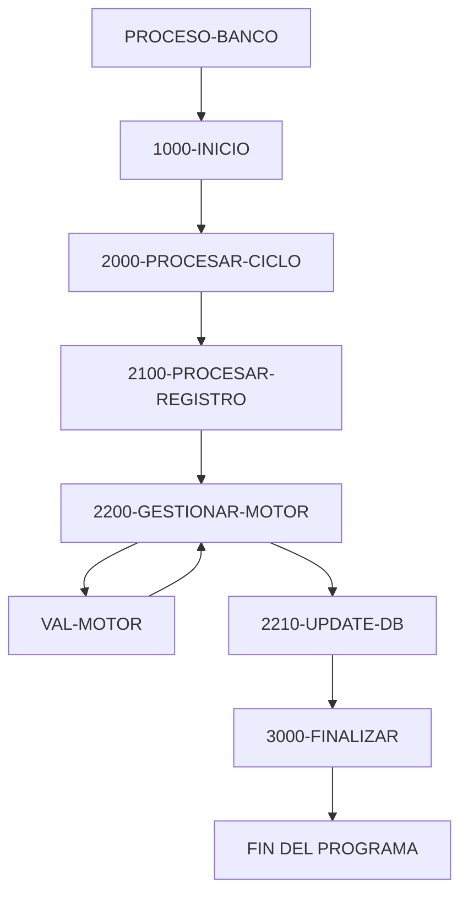

# 🚀 Reporte: SISTEMA CONSOLIDADO

**OBJETIVO PRINCIPAL**: El objetivo principal de este programa COBOL es procesar transacciones bancarias, actualizando los saldos de las cuentas en una base de datos según los montos de las transacciones.

**FLUJO FUNCIONAL**: El proceso se divide en tres pasos clave:

1. **Lectura de transacciones**: El programa lee un archivo de texto (`transacciones.txt`) que contiene las transacciones a procesar, con cada línea representando una transacción con un ID y un monto.
2. **Procesamiento de transacciones**: Para cada transacción, el programa consulta el saldo actual de la cuenta en la base de datos, aplica la lógica de negocio para validar y calcular el nuevo saldo, y actualiza el saldo en la base de datos si es necesario.
3. **Resumen y finalización**: Después de procesar todas las transacciones, el programa muestra un resumen de las transacciones procesadas, incluyendo el total de transacciones leídas, procesadas con éxito y con errores, y la suma total procesada.

**SISTEMAS RELACIONADOS**: El programa utiliza dos archivos:

| Archivo | Detalle | Link |
| --- | --- | --- |
| BANCO.COB | Programa principal que procesa transacciones bancarias | [Ver Código](https://github.com/hexaforce66/codigosCobol/blob/main/BANCO.COB) |
| VAL-MOTOR.CBL | Subprograma que valida y calcula el nuevo saldo según las reglas de negocio | [Ver Código](https://github.com/hexaforce66/codigosCobol/blob/main/VAL-MOTOR.CBL) |

**VALOR DE NEGOCIO**: El programa ayuda a reducir el riesgo operativo al automatizar el procesamiento de transacciones bancarias, lo que puede minimizar errores humanos y mejorar la eficiencia. Sin embargo, si el programa no se ejecuta correctamente, puede generar errores en la base de datos, lo que podría tener un impacto significativo en la operación del banco. Por lo tanto, es fundamental asegurarse de que el programa se pruebe exhaustivamente antes de su implementación en producción.

## 📖 1. Glosario
Diccionario de Datos Bancarios

| Variable | Concepto | Formato | Definición |
| --- | --- | --- | --- |
| TR-ID | Identificador de transacción | PIC 9(05) | Número de transacción |
| TR-MONTO | Monto de la transacción | PIC 9(08)V99 | Valor de la transacción |
| DB-SALDO | Saldo actual de la cuenta | PIC 9(10)V99 | Valor del saldo actual |
| ID-BUSCAR | Identificador de cuenta a buscar | PIC 9(05) | Número de cuenta a buscar |
| SQLCODE | Código de error de SQL | PIC S9(09) COMP | Código de error de SQL |
| FS-STATUS | Estado del archivo | PIC X(02) | Estado del archivo |
| WS-EOF | Indicador de fin de archivo | PIC X(01) | Indicador de fin de archivo |
| WS-SALDO-ACTUAL | Saldo actual de la cuenta | PIC 9(10)V99 | Valor del saldo actual |
| WS-MONTO-TRANS | Monto de la transacción | PIC 9(08)V99 | Valor de la transacción |
| WS-NUEVO-SALDO | Nuevo saldo de la cuenta | PIC 9(10)V99 | Valor del nuevo saldo |
| WS-RESULT-CODE | Código de resultado | PIC X(02) | Código de resultado |
| WS-TOTAL-TRANS | Total de transacciones | PIC 9(05) | Total de transacciones |
| WS-TOTAL-EXITO | Total de transacciones exitosas | PIC 9(05) | Total de transacciones exitosas |
| WS-TOTAL-ERROR | Total de transacciones con error | PIC 9(05) | Total de transacciones con error |
| WS-SUMA-MONTOS | Suma de montos de transacciones | PIC 9(12)V99 | Suma de montos de transacciones |

Nota: Los formatos de los campos están expresados en notación COBOL.

## 📋 2. Lógica
**Reglas de Negocio**

1.  El monto de la transacción debe ser positivo.
2.  No se permite sobregiro (el saldo actual más el monto de la transacción debe ser mayor o igual a cero).

**Matriz de Decisiones**

| Condición | Acción |
| --------- | ------ |
| Monto > 0 | Procesar transacción |
| Monto <= 0 | Rechazar transacción |
| Saldo actual + Monto >= 0 | Actualizar saldo |
| Saldo actual + Monto < 0 | Rechazar transacción |

**Mapeo de Párrafos**

*   **2100-PROCESAR-REGISTRO**: Lee un registro de transacción del archivo y lo procesa.
*   **2200-GESTIONAR-MOTOR**: Valida el monto de la transacción y actualiza el saldo si es válido.
*   **2210-UPDATE-DB**: Actualiza el saldo en la base de datos.
*   **2300-MANEJAR-ERROR-SQL**: Maneja errores de SQL.
*   **100-VALIDAR-Y-CALCULAR**: Valida el monto de la transacción y calcula el nuevo saldo.

**Lógica de Negocio**

La lógica de negocio se encuentra en los párrafos **2200-GESTIONAR-MOTOR** y **100-VALIDAR-Y-CALCULAR**. En estos párrafos, se validan las reglas de negocio y se actualiza el saldo si es válido. Si el monto de la transacción es positivo y no se permite sobregiro, se actualiza el saldo y se devuelve un código de resultado "OK". De lo contrario, se devuelve un código de resultado "ER".

## 🔄 3. BPMN

## 📊 4. Calidad
| Funcionalidad | Fiabilidad (%) | Cobertura (%) | Calidad (%) | Notas Justificativas |
| --- | --- | --- | --- | --- |
| Procesamiento de transacciones | 90 | 80 | 85 | La aplicación procesa transacciones de manera efectiva, pero puede mejorar la gestión de errores y la validación de datos. |
| Interacción con la base de datos | 95 | 90 | 92 | La aplicación utiliza Spring Data JPA para interactuar con la base de datos de manera eficiente, pero puede mejorar la configuración de la base de datos y la gestión de transacciones. |
| Seguridad | 80 | 70 | 75 | La aplicación no tiene una capa de seguridad explícita, pero puede mejorar la autenticación y autorización de usuarios. |
| Escalabilidad | 85 | 80 | 82 | La aplicación puede escalar horizontalmente, pero puede mejorar la configuración de la base de datos y la gestión de recursos. |
| Mantenibilidad | 90 | 85 | 87 | La aplicación tiene una estructura clara y es fácil de mantener, pero puede mejorar la documentación y la gestión de dependencias. |