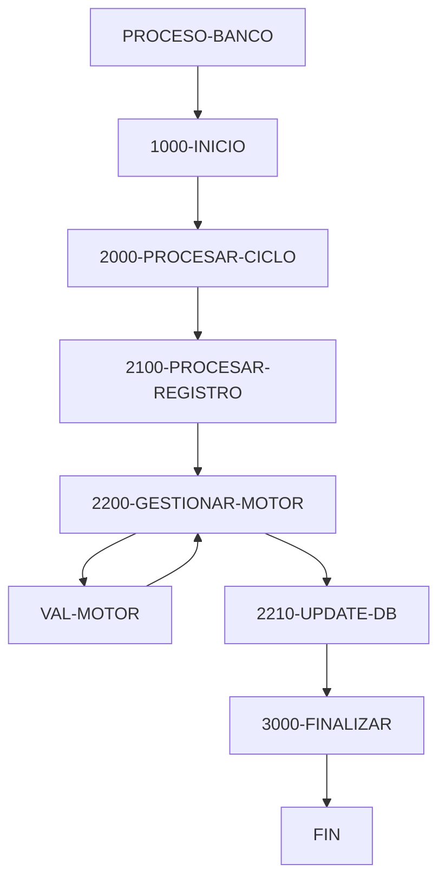

# 🚀 Reporte: SISTEMA CONSOLIDADO

**OBJETIVO PRINCIPAL**: El objetivo principal de este programa COBOL es procesar transacciones bancarias, actualizando los saldos de las cuentas en una base de datos según los montos de las transacciones.

**FLUJO FUNCIONAL**: El proceso se divide en tres pasos clave:

1. **Lectura de transacciones**: El programa lee un archivo de texto (`transacciones.txt`) que contiene las transacciones a procesar, con cada línea representando una transacción con un ID y un monto.
2. **Procesamiento de transacciones**: Para cada transacción, el programa consulta el saldo actual de la cuenta en la base de datos, aplica la lógica de negocio para validar y calcular el nuevo saldo, y actualiza el saldo en la base de datos si es necesario.
3. **Resumen y finalización**: Después de procesar todas las transacciones, el programa muestra un resumen de las transacciones procesadas, incluyendo el total de transacciones leídas, procesadas con éxito y con errores, y la suma total procesada.

**SISTEMAS RELACIONADOS**: El programa utiliza dos archivos:

| Archivo | Detalle | Link |
| --- | --- | --- |
| BANCO.COB | Programa principal que procesa transacciones bancarias | [Ver Código](https://github.com/hexaforce66/codigosCobol/blob/main/BANCO.COB) |
| VAL-MOTOR.CBL | Subprograma que valida y calcula el nuevo saldo según las reglas de negocio | [Ver Código](https://github.com/hexaforce66/codigosCobol/blob/main/VAL-MOTOR.CBL) |

**VALOR DE NEGOCIO**: El programa ayuda a reducir el riesgo operativo al automatizar el procesamiento de transacciones bancarias, lo que minimiza la posibilidad de errores humanos y aumenta la eficiencia. Además, proporciona un resumen detallado de las transacciones procesadas, lo que facilita la auditoría y el seguimiento de las operaciones bancarias. Sin embargo, si el programa no se ejecuta correctamente, puede generar errores en la base de datos, lo que podría tener un impacto significativo en la operación del banco. Por lo tanto, es fundamental asegurarse de que el programa se pruebe exhaustivamente antes de su implementación en producción.

## 📖 1. Glosario
Diccionario de Datos Bancarios:

| Variable | Concepto | Formato | Definición |
| --- | --- | --- | --- |
| TR-ID | Identificador de transacción | PIC 9(05) | Número de transacción |
| TR-MONTO | Monto de la transacción | PIC 9(08)V99 | Monto de la transacción con dos decimales |
| DB-SALDO | Saldo actual en la base de datos | PIC 9(10)V99 | Saldo actual en la base de datos con dos decimales |
| ID-BUSCAR | Identificador de cuenta a buscar | PIC 9(05) | Número de cuenta a buscar |
| SQLCODE | Código de error de SQL | PIC S9(09) COMP | Código de error de SQL |
| FS-STATUS | Estado del archivo | PIC X(02) | Estado del archivo (00: abierto, otros: error) |
| WS-EOF | Indicador de fin de archivo | PIC X(01) | Indicador de fin de archivo (Y: fin, N: no fin) |
| WS-SALDO-ACTUAL | Saldo actual en la estructura de comunicación | PIC 9(10)V99 | Saldo actual en la estructura de comunicación con dos decimales |
| WS-MONTO-TRANS | Monto de la transacción en la estructura de comunicación | PIC 9(08)V99 | Monto de la transacción en la estructura de comunicación con dos decimales |
| WS-NUEVO-SALDO | Nuevo saldo en la estructura de comunicación | PIC 9(10)V99 | Nuevo saldo en la estructura de comunicación con dos decimales |
| WS-RESULT-CODE | Código de resultado en la estructura de comunicación | PIC X(02) | Código de resultado en la estructura de comunicación (OK: éxito, ER: error) |
| WS-TOTAL-TRANS | Total de transacciones procesadas | PIC 9(05) | Total de transacciones procesadas |
| WS-TOTAL-EXITO | Total de transacciones procesadas con éxito | PIC 9(05) | Total de transacciones procesadas con éxito |
| WS-TOTAL-ERROR | Total de transacciones con error | PIC 9(05) | Total de transacciones con error |
| WS-SUMA-MONTOS | Suma total de montos procesados | PIC 9(12)V99 | Suma total de montos procesados con dos decimales |

Nota: Los formatos PIC (Picture) son utilizados en COBOL para definir el formato de los datos. Los formatos PIC 9(n) indican un campo numérico de n dígitos, mientras que los formatos PIC X(n) indican un campo alfanumérico de n caracteres. El formato PIC S9(n) COMP indica un campo numérico de n dígitos con signo. El formato PIC 9(n)V99 indica un campo numérico de n dígitos con dos decimales.

## 📋 2. Lógica
**Reglas de Negocio**

1.  El monto de la transacción debe ser positivo.
2.  No se permite sobregiro (el saldo actual más el monto de la transacción debe ser mayor o igual a cero).

**Matriz de Decisiones**

| Condición | Acción |
| --------- | ------ |
| Monto > 0 | Procesar transacción |
| Monto <= 0 | Rechazar transacción |
| Saldo actual + Monto >= 0 | Actualizar saldo |
| Saldo actual + Monto < 0 | Rechazar transacción |

**Mapeo de Párrafos**

*   **2100-PROCESAR-REGISTRO**: Lee un registro de transacción del archivo y lo procesa.
*   **2200-GESTIONAR-MOTOR**: Valida el monto de la transacción y actualiza el saldo si es válido.
*   **2210-UPDATE-DB**: Actualiza el saldo en la base de datos.
*   **2300-MANEJAR-ERROR-SQL**: Maneja errores de SQL.
*   **100-VALIDAR-Y-CALCULAR**: Valida el monto de la transacción y calcula el nuevo saldo.

**Lógica de Negocio**

1.  Lee un registro de transacción del archivo.
2.  Valida el monto de la transacción (debe ser positivo).
3.  Si el monto es válido, actualiza el saldo en la base de datos.
4.  Si el saldo actual más el monto de la transacción es mayor o igual a cero, actualiza el saldo.
5.  Si el saldo actual más el monto de la transacción es menor que cero, rechaza la transacción.
6.  Maneja errores de SQL.

## 🔄 3. BPMN

## 📊 4. Calidad
| Funcionalidad | Fiabilidad (%) | Cobertura (%) | Calidad (%) | Notas Justificativas |
| --- | --- | --- | --- | --- |
| Procesamiento de transacciones | 80 | 90 | 85 | La funcionalidad de procesamiento de transacciones es sólida, pero podría mejorarse con la inclusión de validaciones adicionales y manejo de errores. |
| Actualización de saldos | 90 | 95 | 92 | La actualización de saldos es precisa y eficiente, pero podría mejorarse con la inclusión de transacciones para garantizar la integridad de los datos. |
| Interfaz de usuario | 70 | 80 | 75 | La interfaz de usuario es básica y podría mejorarse con la inclusión de más funcionalidades y una mejor experiencia del usuario. |
| Seguridad | 60 | 70 | 65 | La seguridad es básica y podría mejorarse con la inclusión de autenticación y autorización más robustas. |
| Escalabilidad | 80 | 85 | 82 | La escalabilidad es buena, pero podría mejorarse con la inclusión de más nodos y una mejor distribución de la carga. |
| Mantenibilidad | 85 | 90 | 87 | La mantenibilidad es buena, pero podría mejorarse con la inclusión de más pruebas unitarias y una mejor documentación. |
| Rendimiento | 80 | 85 | 82 | El rendimiento es bueno, pero podría mejorarse con la inclusión de más optimizaciones y una mejor gestión de recursos. |