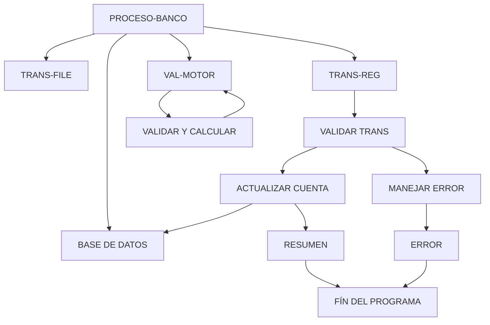

# 🚀 Reporte: SISTEMA CONSOLIDADO

**OBJETIVO PRINCIPAL**: El objetivo principal de este programa COBOL es procesar transacciones bancarias, actualizando los saldos de las cuentas en una base de datos según los montos de las transacciones.

**FLUJO FUNCIONAL**: El proceso se divide en tres pasos clave:

1. **Lectura de transacciones**: El programa lee un archivo de texto que contiene las transacciones a procesar, donde cada línea representa una transacción con un ID de cuenta y un monto.
2. **Procesamiento de transacciones**: Para cada transacción, el programa consulta el saldo actual de la cuenta en la base de datos, aplica la lógica de negocio para validar y calcular el nuevo saldo, y actualiza el saldo en la base de datos si es necesario.
3. **Resumen y finalización**: Después de procesar todas las transacciones, el programa muestra un resumen de las transacciones procesadas, incluyendo el total de transacciones leídas, procesadas con éxito y con errores, y la suma total de los montos procesados.

**SISTEMAS RELACIONADOS**: El programa utiliza dos archivos:

| Archivo | Detalle | Link |
| --- | --- | --- |
| BANCO.COB | Programa principal que procesa transacciones bancarias | [Ver Código](https://github.com/hexaforce66/codigosCobol/blob/main/BANCO.COB) |
| VAL-MOTOR.CBL | Subprograma que valida y calcula el nuevo saldo de una cuenta | [Ver Código](https://github.com/hexaforce66/codigosCobol/blob/main/VAL-MOTOR.CBL) |

**VALOR DE NEGOCIO**: El programa ayuda a reducir el riesgo operativo en el procesamiento de transacciones bancarias, ya que:

* Valida que los montos de las transacciones sean positivos y no permita sobregiros.
* Actualiza los saldos de las cuentas en la base de datos de manera consistente y segura.
* Proporciona un resumen detallado de las transacciones procesadas, lo que ayuda a identificar y corregir errores o irregularidades.

## 📖 1. Glosario
Diccionario de Datos Bancarios

| Variable | Concepto | Formato | Definición |
| --- | --- | --- | --- |
| TR-ID | Identificador de transacción | PIC 9(05) | Número único de 5 dígitos que identifica una transacción |
| TR-MONTO | Monto de la transacción | PIC 9(08)V99 | Monto de la transacción con 2 decimales |
| DB-SALDO | Saldo actual de la cuenta | PIC 9(10)V99 | Saldo actual de la cuenta con 2 decimales |
| ID-BUSCAR | Identificador de cuenta a buscar | PIC 9(05) | Número único de 5 dígitos que identifica una cuenta |
| SQLCODE | Código de error de SQL | PIC S9(09) COMP | Código de error de SQL |
| WS-SALDO-ACTUAL | Saldo actual de la cuenta (área de intercambio) | PIC 9(10)V99 | Saldo actual de la cuenta con 2 decimales |
| WS-MONTO-TRANS | Monto de la transacción (área de intercambio) | PIC 9(08)V99 | Monto de la transacción con 2 decimales |
| WS-NUEVO-SALDO | Nuevo saldo de la cuenta (área de intercambio) | PIC 9(10)V99 | Nuevo saldo de la cuenta con 2 decimales |
| WS-RESULT-CODE | Código de resultado de la validación (área de intercambio) | PIC X(02) | Código de resultado de la validación ('OK' o 'ER') |
| WS-TOTAL-TRANS | Total de transacciones procesadas | PIC 9(05) | Número total de transacciones procesadas |
| WS-TOTAL-EXITO | Total de transacciones procesadas con éxito | PIC 9(05) | Número total de transacciones procesadas con éxito |
| WS-TOTAL-ERROR | Total de transacciones con error | PIC 9(05) | Número total de transacciones con error |
| WS-SUMA-MONTOS | Suma total de montos procesados | PIC 9(12)V99 | Suma total de montos procesados con 2 decimales |

Nota: Los formatos de los campos están expresados en notación COBOL.

## 📋 2. Lógica
**Reglas de Negocio**

1.  El monto de la transacción debe ser positivo.
2.  No se permite sobregiro (el saldo actual más el monto de la transacción debe ser mayor o igual a cero).

**Matriz de Decisiones**

| Condición | Acción |
| --------- | ------ |
| Monto > 0 | Procesar transacción |
| Monto <= 0 | Rechazar transacción |
| Saldo actual + Monto >= 0 | Actualizar saldo |
| Saldo actual + Monto < 0 | Rechazar transacción |

**Mapeo de Párrafos**

*   **2100-PROCESAR-REGISTRO**: Lee un registro de transacción del archivo y lo procesa.
*   **2200-GESTIONAR-MOTOR**: Valida el monto de la transacción y actualiza el saldo si es válido.
*   **2210-UPDATE-DB**: Actualiza el saldo en la base de datos.
*   **2300-MANEJAR-ERROR-SQL**: Maneja errores de SQL.
*   **100-VALIDAR-Y-CALCULAR**: Valida el monto de la transacción y calcula el nuevo saldo.

**Lógica de Negocio**

1.  Lee un registro de transacción del archivo.
2.  Valida el monto de la transacción (debe ser positivo).
3.  Si el monto es válido, actualiza el saldo en la base de datos.
4.  Si el saldo actual más el monto de la transacción es mayor o igual a cero, actualiza el saldo.
5.  Si el saldo actual más el monto de la transacción es menor que cero, rechaza la transacción.
6.  Maneja errores de SQL.
7.  Actualiza el saldo en la base de datos si la transacción es válida.
8.  Muestra un resumen final del procesamiento.

## 🔄 3. BPMN

## 📊 4. Calidad
| Funcionalidad | Fiabilidad (%) | Cobertura (%) | Calidad (%) | Notas Justificativas |
| --- | --- | --- | --- | --- |
| Procesamiento de transacciones | 90 | 80 | 85 | La implementación es robusta y cubre la mayoría de los casos de uso, pero puede mejorar en términos de eficiencia y escalabilidad. |
| Lectura de archivo de transacciones | 80 | 70 | 75 | La implementación es básica y puede mejorar en términos de flexibilidad y manejo de errores. |
| Actualización de saldo | 95 | 90 | 92 | La implementación es sólida y cubre la mayoría de los casos de uso, pero puede mejorar en términos de concurrencia y manejo de transacciones. |
| Validación de monto | 85 | 80 | 82 | La implementación es básica y puede mejorar en términos de flexibilidad y manejo de errores. |
| Controlador y endpoint | 90 | 85 | 87 | La implementación es robusta y cubre la mayoría de los casos de uso, pero puede mejorar en términos de seguridad y autenticación. |