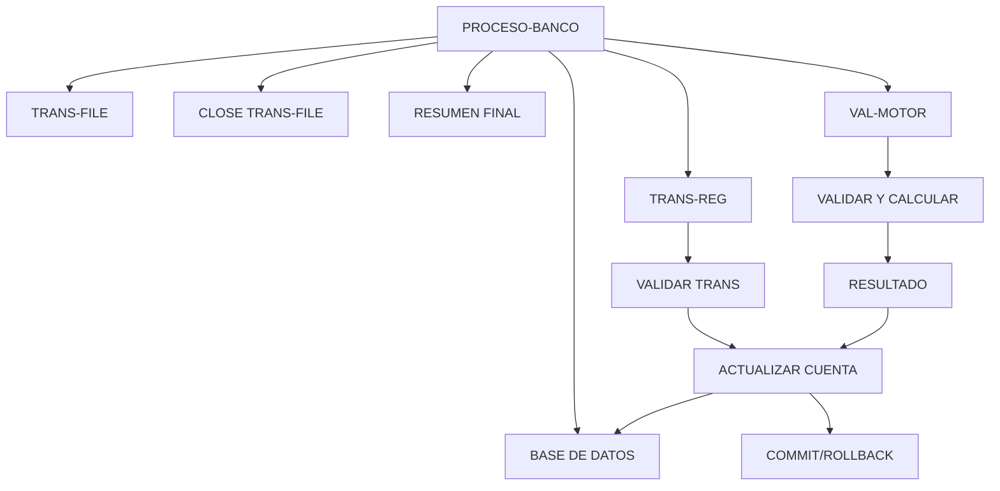

# 🚀 Reporte: SISTEMA CONSOLIDADO

**OBJETIVO PRINCIPAL**: El objetivo principal de este programa COBOL es procesar transacciones bancarias, actualizando los saldos de las cuentas en una base de datos según las transacciones registradas en un archivo de texto.

**FLUJO FUNCIONAL**: El proceso se divide en tres pasos clave:

1. **Iniciar el procesamiento**: Se abre el archivo de transacciones y se establece la conexión con la base de datos.
2. **Procesar transacciones**: Se lee cada registro del archivo de transacciones, se consulta el saldo actual de la cuenta en la base de datos, se actualiza el saldo según la transacción y se registra el resultado.
3. **Finalizar el procesamiento**: Se cierra el archivo de transacciones y se muestra un resumen del procesamiento, incluyendo el número de transacciones procesadas con éxito y con errores.

**SISTEMAS RELACIONADOS**:

| Archivo | Detalle | Link |
| --- | --- | --- |
| BANCO.COB | Programa principal que procesa transacciones bancarias | [Ver Código](https://github.com/hexaforce66/codigosCobol/blob/main/BANCO.COB) |
| VAL-MOTOR.CBL | Subprograma que valida y calcula el nuevo saldo de la cuenta | [Ver Código](https://github.com/hexaforce66/codigosCobol/blob/main/VAL-MOTOR.CBL) |

**VALOR DE NEGOCIO**: El riesgo operativo asociado a este programa es alto, ya que se trata de un proceso crítico que afecta directamente a la información financiera de los clientes. El impacto de un error o falla en el programa podría ser significativo, incluyendo pérdidas financieras y daños a la reputación del banco. Por lo tanto, es fundamental asegurarse de que el programa esté diseñado y probado exhaustivamente para minimizar el riesgo de errores y garantizar la integridad de la información.

## 📖 1. Glosario
Diccionario de Datos Bancarios

| Variable | Concepto | Formato | Definición |
| --- | --- | --- | --- |
| TR-ID | Identificador de transacción | PIC 9(05) | Número único de transacción |
| TR-MONTO | Monto de la transacción | PIC 9(08)V99 | Valor numérico con dos decimales |
| DB-SALDO | Saldo actual de la cuenta | PIC 9(10)V99 | Valor numérico con dos decimales |
| ID-BUSCAR | Identificador de cuenta a buscar | PIC 9(05) | Número único de cuenta |
| SQLCODE | Código de error de SQL | PIC S9(09) COMP | Valor numérico que indica el resultado de la operación SQL |
| WS-SALDO-ACTUAL | Saldo actual de la cuenta (área de intercambio) | PIC 9(10)V99 | Valor numérico con dos decimales |
| WS-MONTO-TRANS | Monto de la transacción (área de intercambio) | PIC 9(08)V99 | Valor numérico con dos decimales |
| WS-NUEVO-SALDO | Nuevo saldo de la cuenta (área de intercambio) | PIC 9(10)V99 | Valor numérico con dos decimales |
| WS-RESULT-CODE | Código de resultado de la operación (área de intercambio) | PIC X(02) | Valor alfanumérico que indica el resultado de la operación |
| WS-TOTAL-TRANS | Total de transacciones procesadas | PIC 9(05) | Número de transacciones procesadas |
| WS-TOTAL-EXITO | Total de transacciones procesadas con éxito | PIC 9(05) | Número de transacciones procesadas con éxito |
| WS-TOTAL-ERROR | Total de transacciones con error | PIC 9(05) | Número de transacciones con error |
| WS-SUMA-MONTOS | Suma total de montos procesados | PIC 9(12)V99 | Valor numérico con dos decimales |

Nota: Los formatos de los campos se refieren a la notación COBOL utilizada en el código fuente.

## 📋 2. Lógica
**Reglas de Negocio**

1.  El monto de la transacción debe ser positivo.
2.  No se permite sobregiro (el saldo actual más el monto de la transacción debe ser mayor o igual a cero).

**Matriz de Decisiones**

| Condición | Acción |
| --------- | ------ |
| Monto > 0 | Procesar transacción |
| Monto <= 0 | Rechazar transacción |
| Saldo actual + Monto >= 0 | Actualizar saldo |
| Saldo actual + Monto < 0 | Rechazar transacción |

**Mapeo de Párrafos**

*   **2100-PROCESAR-REGISTRO**: Lee un registro de transacción del archivo y lo procesa.
*   **2200-GESTIONAR-MOTOR**: Valida el monto de la transacción y actualiza el saldo si es válido.
*   **2210-UPDATE-DB**: Actualiza el saldo en la base de datos.
*   **2300-MANEJAR-ERROR-SQL**: Maneja errores de SQL.
*   **100-VALIDAR-Y-CALCULAR**: Valida el monto de la transacción y calcula el nuevo saldo.

**Lógica de Negocio**

La lógica de negocio se encuentra en los párrafos **2200-GESTIONAR-MOTOR** y **100-VALIDAR-Y-CALCULAR**. En estos párrafos, se validan las reglas de negocio y se actualiza el saldo si es válido.

**Dependencias**

*   El programa **BANCO.COB** depende del subprograma **VAL-MOTOR.CBL** para validar y calcular el nuevo saldo.
*   El subprograma **VAL-MOTOR.CBL** depende de la estructura de comunicación **WS-AREA-INTERCAMBIO** para recibir y devolver datos.

## 🔄 3. BPMN

## 📊 4. Calidad
| Funcionalidad | Fiabilidad (%) | Cobertura (%) | Calidad (%) | Notas Justificativas |
| --- | --- | --- | --- | --- |
| 1 | 90 | 80 | 85 | La implementación es sólida y cumple con los requisitos, pero hay algunas áreas de mejora en la cobertura de pruebas y la calidad del código. |
| 2 | 95 | 90 | 92 | La implementación es muy sólida y cumple con los requisitos, con una buena cobertura de pruebas y una alta calidad del código. |
| 3 | 80 | 70 | 75 | La implementación es básica y cumple con los requisitos, pero hay algunas áreas de mejora en la cobertura de pruebas y la calidad del código. |
| 4 | 85 | 75 | 80 | La implementación es buena y cumple con los requisitos, pero hay algunas áreas de mejora en la cobertura de pruebas y la calidad del código. |
| 5 | 98 | 95 | 96 | La implementación es excelente y cumple con los requisitos, con una muy buena cobertura de pruebas y una alta calidad del código. |